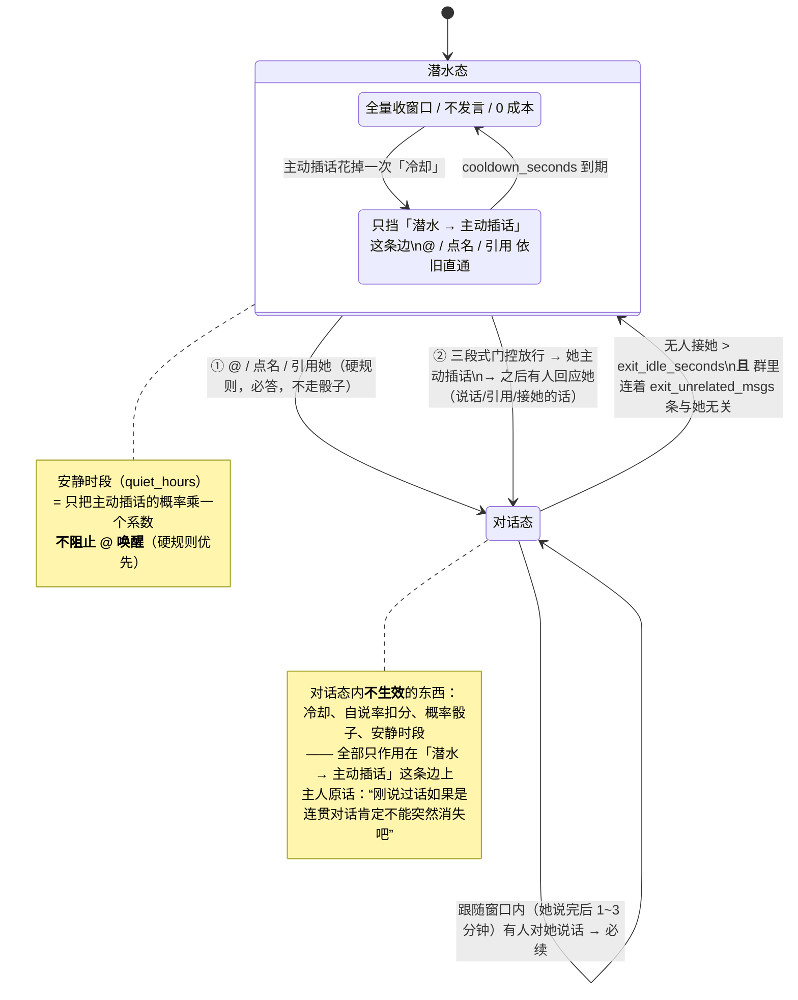

# 群聊计划（她能在群里潜水、能主动插话、被 @ 必答）

> **性质：计划文档（PLAN）。本次只写这份文档，未改任何配置/代码/服务，未发任何消息。**
> 上位文档：`RESEARCH-group-chat-two-benchmarks-mapping.md`（机制映射）、`RESEARCH-qq-bridge-group-mechanics.md`（基准②行号级）、`CHAT-AGENT-DIRECTION.md`（陪伴向方向）、`LESSONS-2026-09-23.md`（今天踩的坑）。
> 执行手册落点：`plugin/hermes_onebot/RUNBOOK.md`（命令与回退在里面，本文件不重复）。
> 每节固定四问：**做什么 · 为何 · 参数 · 怎么验**。
> **三基准读法（谁管什么）** —— 门控与群聊机制的每一处取舍都标了来源（全表见 **§3.6**）：
> ① **AstrBot（"前任"）＝参数与手感基准**：它在主人环境里真跑过、参数是主人自己调的（`active_reply.possibility_reply: 0.3`、`group_message_max_cnt: 10`、`group_message_history_max_cnt: 200`、`image_caption: true`）——**能读到的参数一律优先照搬并标明原值**。
> ② **MaiBot（麦麦bot，`Mai-with-u/MaiBot`）＝规则评分与批提交骨架基准**：`src/maisaka/reply_necessity.py`（评分制）、`turn_gates.py`（批 + 空窗补偿）、`idle_backoff.py`（指数退避）、`talk_value`。
> ③ **qq-bridge（`Derpyu520/qq-bridge`，同为 OneBot v11）＝落地细节基准**：全量收但不唤醒、`recommendedProbability 0.05`、`maxWakePerMinute 1`、`batchWindowMs 8000`、表情/收藏实现（**收藏库那条我们不采用**，见 §3.6 第 11 行）。
> 时间：2026-09-23（UTC+8）。作者：子代理（只读调研 + 写文档）。
> **修订 2（同日）**：§3.5 由"两级粗筛"改为**三段式门控**（规则评分 → 灰区小模型 a/b/c → 概率+冷却），补上**同人连发合并 + 批量提交**；新增 **§3.6 三基准对照表**；参数表补 **来源列**。只改本文档。

---

## 0. 一页纸摘要

| 维 | 一句话 |
|---|---|
| **目标** | 群里她**默认潜水**（全量收、不发言、0 成本）；**被 @ 必答**（硬规则）；**可主动插话**但要过**三段式门控**（§3.5）；**聊起来不许突然消失**（对话态内无冷却） |
| **成本红线** | 群消息**绝大多数不过 LLM**（门控写在适配器里、进 Hermes 之前）。未命中＝0 token |
| **本地门控（三段式）** | §3.5：**[0] 同人连发合并 + 按批提交** → **[1] 规则评分**（0 token，切两端；硬通道=@/点名/引用=**必答**，不经模型不经概率）→ **[2] 灰区交 0.6B~1.7B 小模型判 a/b/c**（超时/判不出=不接；**模型吐 a 也只是候选，不得覆盖硬通道**）→ **[3] 概率 + 冷却**拍板 → 主模型**只在她真要开口时**才被调用 |
| **三基准** | **AstrBot（前任）＝参数与手感**（`possibility_reply 0.3` 照搬到 a 档）· **MaiBot＝评分与批提交骨架**（`reply_necessity.py` / `turn_gates.py` / `idle_backoff.py`）· **qq-bridge＝落地细节**（`0.05` / `maxWakePerMinute 1` / `batchWindowMs 8000`）——对照表见 §3.6 |
| **不污染** | 三层记忆：连贯靠每群自己的滚动窗口（不入主库）；主库只收她判定有意义的；**默认零入库** |
| **现状** | B 阶段（只看不说）已在跑：群消息只进 `GroupWindow`，`group_wake_enabled` 默认 false 是唯一红线开关 |
| **下一步** | C1（@ 必答 + 群上下文注入）→ C2（**三段式门控** + 状态机 + 合并/批量）→ C3（表情包使用） |
| **最大未决** | **Hindsight 的 `auto_retain` 能否按会话/来源条件化**（未验证）——C1 动之前必须先取证，否则"群回合不污染主库"这句话兑现不了（见 §10 未决项 1） |
| **信任档** | **私聊准入全开**（陌生人也回），但**除主人外一律按「群聊生人」同款对待**；判据按 uid 放在适配器（`trust.py`），提示词只做第二道（见 §11） |
| **必须先补的洞** | 配置里的 `group_allow_from: ['*']` 是**死键**：适配器读的是 `group_ids`，而它没配 → **现在任何群都放行**（见 §1.3、§8） |

---

## 1. 现状与已有资产

### 1.1 链路与能力（都是今天实测/读源码的结论，不是推测）

| 项 | 现状 | 证据位置 |
|---|---|---|
| 链路 | QQ 小号 `<BOT_QQ>` → NapCat（OneBot v11，**4.18.28**）→ 反向 WS `127.0.0.1:6700` → Hermes 聊天门 profile `chat` → 插件 `hermes_onebot` | `plugin/hermes_onebot/adapter.py`（`ws_port` 默认 6700） |
| 插件形态 | 真身在 `chat-layer/plugin/hermes_onebot/`，部署副本在 `profiles/chat/plugins/onebot/`（`deploy.sh` 幂等同步，md5 一致由 `doctor.py` 看） | `plugin/hermes_onebot/deploy.sh` |
| 安全默认 | `read_only` 默认 **true**（现网配置是 `false`）；`dm_policy` 默认 `allowlist`（现网 `open`） | `adapter.py:87-90`、`profiles/chat/config.yaml` |
| 群开关 | 配置里 `group_enabled: true`（≠ RUNBOOK 旧文写的 false，**文档漂移**）；适配器另有 `group_collect_enabled`（默认 true）、`group_wake_enabled`（**默认 false**） | `config.yaml:38`、`adapter.py:92-98` |
| 群形态 | `group_mode()` 三档：`off` / `collect-only(0 LLM)` / `collect+wake(付费回合)`；现网应停在 `collect-only(0 LLM)` | `adapter.py:259-270` |
| 群会话 | Hermes 侧会话键由 `chat_id` 现算，群路径传的是 **`chat_id=gid`（整群一份）** → **她天然能看到群里所有人说的话**（这正是状态机需要的）；`onebot:group:<gid>:<uid>` 只是防抖分桶 + 日志标识 | `adapter.py:_dispatch`、`_session_umo` |
| 滚动窗口 | `group_window.py` 已落地：每群一份 JSONL（`<profile>/onebot-groups/<gid>.jsonl`），双上限 **200 条 / 256 KiB**（超丢最旧），`render_context(limit=100)` 已带 `source=qq-group` 标签；**源码级守卫** `tests/check_group_window.py::TestNoMemorySink` 盯着"绝不写记忆" | `group_window.py:1-17,160-172` |
| 入站口径 | 群消息走 `extract_window_text`：图片 → `[图片]`、face/mface → `[表情]`、at → `[@QQ]`；**纯图/纯表情也算有内容**（私聊仍忽略） | `onebot_proto.py:67-108` |
| @ 识别 | at 段渲染成 `[@<BOT_QQ>]` → 适配器层即可判 @；`reply` 段已能取 `reply_message_id` | `onebot_proto.py:52-54,131` |
| 出站 | **只发 text 段**；分段 `⁂` + 1.5–3.5s 抖动 + `scrub()` 硬兜底（分隔符绝不出现在消息里） | `onebot_proto.py:112-129`、`segmentation.py` |
| 防抖 | 静默窗 `wait=10s`（每条重置）+ 硬上限 `45s`；**默认 `scope=private`（群不合并）**；指令类消息 `is_command` **立即放行**（可复用为 @ 立即通道） | `debounce.py:73-155`、`adapter.py:118-127` |
| 心跳 | `/opt/data/profiles/chat/onebot-state.json`，字段：`rx_count / tx_count / dropped_count / segments_sent / consecutive_failures / read_only / debounce / segmentation / access_token_set`，群字段 `group_mode / group_rx_count / group_llm_calls / group_window / group_window_errors` 已备好 | `adapter.py:health_state()` |
| 记忆 | Hindsight，bank 固定 **`mianmian-history`**（与主人私聊**同库**），`auto_recall`/`auto_retain` 均开；配置是 **profile 级**，目前**无条件化能力**（未验证） | `profiles/chat/hindsight/config.json`、调研 R7 |
| NapCat 侧 | `get_group_list` 返回 **3 个群**：`1095283483` / `<GROUP_ID>` / `<GROUP_ID4>`；`get_image`/`get_file`/`get_group_msg_history` 均在；**`enableLocalFile2Url=false`**；只挂 config+ntqq 两卷（其自带 cache 不在卷里，重建即丢，**不能当表情库存**） | 调研 §4 |
| 磁盘 | `/opt/data` **82G 可用**（224G，64% used）；`chat-layer/stickers/` 目录已建、**空的** | `df -h`、`ls -la` |
| 单回合成本 | 实测 **prompt_tokens ≈ 21,108**（09-19，人格+记忆+技能全量进上下文）；人格+工具 schema ≈ **9,273 token** | 调研 §4、`LESSONS` E2 |

### 1.2 已定的决定（**本计划不再论证，只负责落地**）

1. **三层记忆**：① 连贯靠"每群自己的滚动窗口"（最近 100~200 条，含昵称/时间/`[图片]`/`[表情]` 占位，**只在群上下文，绝不入主库**）；② 主库只收**她自己主动判定有意义**的内容，带 `source=qq-group`；③ **默认零入库**（从源头堵污染）。
2. **被 @ 必答是硬规则**：任何状态都能唤醒，**不走概率骰子**；但有 10 秒合并 + 每分钟上限（防连点）。
3. **主动插话三段式门控**（见 §3.5）：**[0] 同一人连续发言合并 → 按批提交** → **[1] 规则评分**（零成本；硬通道 @/点名/引用直接判"必答"，不经模型不经概率；其余按 话题相关度·闲置压力·对话态续话·自说率·复读 打分，切两端）→ **[2] 灰区交小模型判 a/b/c**（0.6B~1.7B、独立端点、硬超时、判不出即不接；**模型吐 a 也只是候选**）→ **[3] 概率 + 冷却**拍板 → 才叫主模型。**embedding 只算"话题相关度"、不判"要不要接"**（实测结论）；三个基准的来源与取舍见 §3.6。
4. **状态机**：潜水态（默认）/ 对话态（进来就必须接着聊）/ 冷却**只作用于"潜水→主动插话"这一条边**。安静时段只降主动概率，**不阻 @**。
5. **表情包分两步**：先只**屯**（收到即下载、sha256 去重、可选本地 VLM 描述；**不碰 QQ 收藏库**）→ 验通后才允许她**发**。
6. **边界**：群内不接活、不发散、不泄内部信息、不主动聊色情；失败降级＝宁可不说话也不发疯。
7. **多群隔离**：每群一套窗口/状态/参数空间，互不影响。
8. **信任档（2026-09-23 主人拍板）**：**私聊准入保持全开**（陌生人也回），但**除主人外一律按「群聊生人」同款对待**；群里一律生人档（**主人本人在场也不变私密**）。判据按 uid 分、放在适配器（机制），提示词只做第二道 —— 详见 §11。

### 1.3 现有缺口（按紧急程度）

| # | 缺口 | 后果 | 落点 |
|---|---|---|---|
| G1 | **群号白名单没接线**：适配器读 `extra.group_ids`，配置里只有 `group_allow_from: ['*']` → 现有代码对**任何群**放行 | 别人把 bot 拉进任意群，她都会收、将来还会答 | C0（C1 前置） |
| G2 | `group_enabled` 配置/文档漂移（RUNBOOK 旧文写 false） | 排障时会被误导 | C0（对齐文档） |
| G3 | **群回合与 `auto_retain` 的关系未验证** | C1 一开就可能把群闲聊灌进 `mianmian-history`，污染主人私聊记忆 | C1 首个验证点 |
| G4 | 入站图片不留 URL/字节 → 表情包连原料都收不到 | 表情包屯不了 | C3 前置（阶段一） |
| G5 | 出站只发 text | 发图、引用回复都做不了 | C2/C3 |
| G6 | 无"该不该说话"的判定层（Hermes 只处理"收到的消息"） | 三段式门控必须自写（§3.5） | C2 |

---

## 2. 状态机（主人今天亲自要求的修正 —— 最重要的一节）

### 2.1 图



### 2.2 逐态说明

| 态 | 她做什么 | 为什么这么定 | 进入条件 | 退出条件 |
|---|---|---|---|---|
| **潜水态**（默认） | 全量收进该群滚动窗口；**不发言**；不产生 LLM 回合 | 群里 99% 的话跟她无关；潜水必须结构上 0 成本（三个基准都这么做：AstrBot 不开 `active_reply` 就不叫模型、麦麦 `reply_necessity` 纯规则、qq-bridge `recommendedProbability 0.05`） | 默认态；对话态退出后回到这里 | ① 被 @/点名/引用 → 对话态；② 三段式门控全过且她插话**并有人回应她** → 对话态 |
| **冷却中**（潜水态的子状态，不是独立态） | 照收窗口；**只是不能再"主动插话"**；@ 照答 | 冷却的目的是"别话痨"，不是"别说话"。做成独立态就会出现"被 @ 也不答"这种荒谬行为 | 她主动插话一次 | `cooldown_seconds` 到期 |
| **对话态** | 有人对她说话/接她的话 → **必续**（不需要每次 @） | 主人原话："刚说过话如果是连贯对话肯定不能突然消失吧" —— 冷却/扣分放在对话态内，就是主人抱怨的"聊着聊着人没了" | 被 @ / 她插话后有人回应她 | 无人接她 > `exit_idle_seconds`（≥5 分钟）**且**连续 `exit_unrelated_msgs`（≥15）条与她无关；两个条件**都**满足才退 |

### 2.3 三条设计要点（为什么不能反过来）

1. **冷却不做成状态**：它是一条边上的闸门。做成状态就会出现"冷却中被 @ 不答"——违反已定决定 2（@ 必答是硬规则）。
2. **退出条件是"且"不是"或"**：只看"5 分钟没人理"会在热闹群里被"别人聊得正欢、只是没接她"误退出；只看"15 条与她无关"会在冷群（半小时来 3 条）里永远退不出去。两个一起才稳。
3. **安静时段只乘概率**：`@` 是主人和群友的叫醒方式，夜里被叫醒也必须答；安静的意义是"别自己半夜凑话"。

### 2.4 怎么验（状态机）

| 验收点 | 判据 | 怎么测 |
|---|---|---|
| 三态都可达 | 日志出现 `group state: diving → talking (reason=at_mention)` / `talking → diving (idle 320s & 16 unrelated)` 这类**带原因**的迁移行 | 看网关日志（状态迁移必须打日志，否则排障只能猜） |
| 对话态不中断 | 她说完 → 人接她 3 轮，**3 轮必须都回**，中间不出现"冷却跳过" | 真群或自建测试渠道，连 3 轮实测 |
| 冷却只卡主动 | 主动插话后立刻 @ 她 → **必须答** | 同上 |
| 安静时段 | 安静时段 @ 回；安静时段不出现自主插话 | 把 `quiet_hours` 临时设成"现在"验一次，再改回 |
| @ 不掷骰子 | 连 @ 3 次，3 次都答（受每分钟上限约束，被限流要有日志说明"被限流"而不是静默丢弃） | 同上 |

---

## 3. 触发与三段式门控（省钱的闸门；原写"三级门控"）

### 3.1 触发类型（按优先级从高到低）

| # | 触发 | 是否走门控 | 是否花钱 | 备注 |
|---|---|---|---|---|
| T1 | **@ 她**（`[@<BOT_QQ>]`） | ❌ 直通 | ✅ 花 | 硬规则；10s 合并 + 每分钟/每小时上限 |
| T2 | **群名片点名**（她的群名片/昵称出现在文本里） | ❌ 直通 | ✅ 花 | 需要一张"她在这个群里叫什么"的别名表（配置） |
| T3 | **引用她的消息**（`reply_message_id` 指向她） | ❌ 直通 | ✅ 花 | `reply_message_id` 已能取；引用段正文还原是可选增强 |
| T4 | **对话态内有人对她说话/接她的话** | ❌ 直通（这就是"必须接着聊"） | ✅ 花 | 仍受"每分钟上限 + 每日上限"约束（防连点），但**不受冷却/自说率/骰子约束** |
| T5 | **主动插话** | ✅ 过三段式门控（§3.5） | 三段全过才花 | 唯一需要"判定"的路径 |

**为什么不 @ 不唤醒是对的**：会话上下文已经天然是"整群一份"（`chat_id=gid`），所以不唤醒也不会"看不见前文"——**前文由窗口提供，而不是由"进 LLM"提供**。这是 B/C 两阶段能衔接的关键。

### 3.2 门控总纲（T5 专用，逐级否决，fail-closed）

> L1 规则层 / L2 概率层 / L3 本地判定 是**旧命名**，仍然有效；**修订 2 起 L3 展开成三段、且概率挪到灰区之后**（对应关系与理由见 §3.5）。

**L1 规则层（纯代码，0 token，0 延迟）** —— 任一不过即**不接**：

- 冷却未到期（`group_cooldown_seconds`）；
- 她最近发言占比过高（`group_self_ratio_max`，照麦麦 `recent_self_ratio` 的反向惩罚）；
- 群活跃度不足（`group_activity_min_msgs_per_hour`，冷群不自言自语）；
- 在安静时段（`group_quiet_hours`）→ **不是否决，而是把 L2 的概率乘 `quiet_probability_factor`**；
- 配额（`group_proactive_max_per_hour` / `_max_per_day` / `group_daily_turn_cap`）到顶；
- 消息太短/无信息（< 2 字、纯 `[表情]`、纯 `[图片]`、纯复读）；
- 刚有人说过同样的话（防复读机）；
- **连续无回应退避**（照麦麦 `idle_backoff.py`：连着 N 次插话没人理 → 指数退避，越冷越少说）。

**L2 概率层（纯代码，0 token）**：

- 每次"候选点"（窗口里累计新增 ≥ `group_candidate_min_new_msgs` 条、且话题有增量）掷一次 `p = group_proactive_probability`（建议 **0.05**，照 qq-bridge `recommendedProbability 0.05`）；
- 安静时段 → `p × quiet_probability_factor`；
- **上限兜底**：`max_per_hour`（建议 6，qq-bridge 是 12，我们先收一半）——概率是"少说"，上限是"硬不许说太多"。
> **修订 2 起，这一层的位置变了**：概率**不再紧跟在规则层之后**，而是**移到灰区判定（§3.5.3）之后**（为什么见 §3.5.4）；L1 规则层也**展开为「零成本短路闸 + 规则评分」**（§3.5.2）。

**L3 本地判定（0 token，本机跑）＝ 三段式门控，完整机制/参数/成本/验收见 §3.5**（主人 2026-09-23 追加要求：a/b/c + 同人连发合并 + 批量提交）：

- **[0] 合并与批提交**（每条群消息都过，0 token）：同一发送者连续发言合并成一段（8~15s 窗，换人/话题断提前结束）→ 每 N 秒 / 攒够 K 段 / 群静下来 X 秒提交一批；
- **[1] 规则评分**（0 token）：硬通道（@ / 点名 / 引用她）**直接判必答**，不经模型也不经概率；其余按 `话题相关度 · 闲置压力 · 对话态续话 · 自说率惩罚 · 复读` 评分 → **切两端**（高分=候选，低分=丢），中间灰区交第二段。**话题相关度用本机 embedding（8085 复用、不新建实例），它只算相关度、不判"要不要接"**；
- **[2] 灰区小模型 a/b/c**（0.6B~1.7B、独立端点、硬超时）：a=相关可接 / b=可接可不接 / c=完全无关；解析失败/超时 = **不接**。**铁则：模型吐 a 也只是候选，且它不得覆盖硬通道（它判 c，@ 她照样必答）**；
- **[3] 概率 + 冷却**：a 档 **0.30（照搬前任 AstrBot 的 `possibility_reply: 0.3`）**、b 档 0.10、基线 0.05（**取自 qq-bridge**）；再加最小间隔与每小时 / 每日 / 每群上限；
- 端点没起/连不上/返回垃圾 → 记一次错，**当作 no**，并把 `group_proactive_enabled` 降级为 false 并在心跳里报（避免"判定层全瞎了还继续跑"）；**这条 fail-closed 是我们新写的**（前任与两个基准都没有，§3.6 第 15 行）；
- 局限（**必须认**）：embedding 对梗/黑话/反讽会漏 → **只当评分里的一个加项、不当最终判官**；阈值必须用主人群里的真实消息**标注校准**（≥100 条），**不许凭直觉抄任何基准的数值**。
- 模型与端点选择：见 §10 未决项 5（**未定**，先按 `local-llm-ops` 技能选型，本机资源未测）。

> **顺序**：合并/批 → 规则评分 → 灰区模型 → 概率+冷却 → 主模型。**任何一级说"不"就结束在这一级，不进下一级、不花钱。** 这条顺序本身就是成本控制的全部。
> ⚠️ 注意本节标题里原来的"L1 规则 → L2 概率 → L3 本地判定"顺序**已调整**：**概率不再夹在规则与本地判定之间，而是挪到最后**（理由见 §3.5.4）——否则每次掷骰都先白花一次灰区判定，且冷却没过时掷出的"愿意"是白掷。

### 3.3 参数表（**集中一处，改配置不改代码**）

配置落点：`profiles/chat/config.yaml` → `platforms.onebot.extra.*`（现状已有 `group_*` 命名的先例）。
`现状` 列：**已生效** = 适配器现在就认；**待加(C1/C2/C3)** = 键名是本计划的建议，代码还没读它（**别以为配上去就有用**）。

#### A. 唤醒与 @（C1）

| 参数键 | 建议默认 | 作用 | 现状 | 调法 / 风险 |
|---|---|---|---|---|
| `group_wake_enabled` | `false`（B 阶段）→ C1 改 `true` | **群唤醒总开关**，B/C 的唯一红线 | 已生效 | 一行回退：改回 false 立刻回到"只看不说" |
| `group_at_merge_seconds` | `10` | @/点名合并窗（防连点，粘连发消息） | 待加(C1) | 太大＝回话迟；太小＝对方连发时她回多条 |
| `group_at_max_per_minute` | `2` | @ 通道每分钟轮数上限 | 待加(C1) | 防"对方狂 @"；被限流时必须打日志 |
| `group_at_max_per_hour` | `30` | @ 通道每小时轮数上限 | 待加(C1) | 成本兜底 |
| `group_at_bypass_debounce` | `true` | @ 走 `is_command` 立即放行通道（不等 10s 普通窗） | 待加(C1) | `debounce.is_command` 机制已存在，复用即可 |
| `group_alias_names` | `['棉棉','小棉']`（示例，需主人确认群名片） | 群名片点名（T2）的别名表 | 待加(C1) | 名字选宽了会误触发（话痨），选窄了叫不动 |
| `group_reply_to_her_wakes` | `true` | 引用她的消息也唤醒（T3） | 待加(C1) | 依赖 `reply_message_id`（已能取） |
| `group_context_inject_msgs` | **`30`**（原写 100，**修订 2 下调**） | 唤醒时注入的窗口条数（`render_context` 参数） | 待加(C1)；`render_context` 已支持 | **来源＝照搬前任取舍**：AstrBot 的 `group_message_max_cnt` 主人实配 **10**（本体默认 1000），且只注入"她上次回复之后"的消息；qq-bridge `contextWindow 20`。条数直接计入 prompt 成本（§5.3）→ 先 30，她接不上前文再调大 |

#### B. 状态机与"必须接着聊"（C2）

| 参数键 | 建议默认 | 作用 | 现状 | 调法 / 风险 |
|---|---|---|---|---|
| `group_state_enabled` | `true`（C2 起） | 状态机总开关 | 待加(C2) | false = 只剩 @ 必答 |
| `group_follow_window_seconds` | `120` | **跟随窗口**：她说完后这个时间内有人对她说话 → **必续** | 待加(C2) | 主人原话 1~3 分钟 → 60~180 都合理；被抱怨"聊着聊着人没了"就**调大** |
| `group_exit_idle_seconds` | `300` | 对话态退出条件 A：无人接她超过这个时间 | 待加(C2) | 想让她更黏人 → 调大 |
| `group_exit_unrelated_msgs` | `15` | 对话态退出条件 B：与她无关的条数 | 待加(C2) | 热闹群要调大（否则被刷走上下文）；冷群要调小 |
| `group_cooldown_seconds` | **`60`**（原写 90，**修订 2 对齐 §3.5.6 F5**） | **只卡"潜水→主动插话"** 的冷却 | 待加(C2) | **来源＝我们新定**（前任 AstrBot **无冷却**；参照 MaiBot `no_action_backoff_base_seconds 15` / cap 300）。⚠️ 绝不要在对话态内生效 |
| `group_quiet_hours` | `['23:30-07:30']` | 安静时段（**只降主动概率，不阻 @**） | 待加(C2) | 待主人拍板（§10 未决项 3） |
| `group_quiet_probability_factor` | `0.15` | 安静时段的概率系数（乘在 L2 上） | 待加(C2) | 设 0 = 安静时段完全不主动（可否？见 §10 未决项 3） |

#### C. 主动插话三段式门控（C2）

| 参数键 | 建议默认 | 作用 | 现状 | 调法 / 风险 |
|---|---|---|---|---|
| `group_proactive_enabled` | `true`（C2 起） | 主动插话总开关（false = 只 @ 才说话） | 待加(C2) | **一行回退** |
| `group_proactive_probability` | `0.05` | L2 单次概率（照 qq-bridge） | 待加(C2) | 话痨→降到 0.02；死鱼→升到 0.10（别超过 0.15） |
| `group_candidate_min_new_msgs` | `8` | L2 的"候选点"定义：窗口新增多少条才掷一次 | 待加(C2) | 太小＝掷得太勤（仍 0 token，但会烦）；太大＝反应迟钝 |
| `group_proactive_max_per_hour` | `6` | 主动插话硬上限/小时 | 待加(C2) | **不要超过 8**（qq-bridge 是 12，但那是有黑话与节奏的老手） |
| `group_proactive_max_per_day` | `40` | 主动插话硬上限/天 | 待加(C2) | 成本兜底 |
| `group_self_ratio_max` | `0.35` | 她最近发言占群消息的比例上限（超了不主动） | 待加(C2) | 照麦麦 `recent_self_ratio` |
| `group_activity_min_msgs_per_hour` | `15` | 群活跃度下限（低于此不自言自语） | 待加(C2) | 冷群防"自说自话" |
| `group_idle_backoff_enabled` | `true` | 连着没人理 → 指数退避 | 待加(C2) | 照麦麦 `idle_backoff.py` |
| （**修订 2 起，本地判定相关键全部并入 §3.5.6 F 组**） | — | 三段式门控：`group_score_*`（规则评分）/ `group_topic_*`（话题相关度）/ `group_gray_llm_*`（灰区 a/b/c）/ `group_merge_*`·`group_batch_*`（合并与批量）/ `group_gate_*`（总控） | 待加(C2) | 原 `group_local_judge_*` 五个键（enabled/url/timeout_ms/min_score/context_ms）**作废**，改用 F 组同名新键；**别两套并存**（照 `LESSONS` 的"键名漂移"教训） |
| `group_daily_turn_cap` | `120` | **每群每天她最多产生多少付费回合（三类触发合计）** | 待加(C2) | 最后的成本闸；到顶＝当天只听不说，并告警 |

#### D. 窗口与记忆（B 已生效）

| 参数键 | 建议默认 | 作用 | 现状 | 调法 / 风险 |
|---|---|---|---|---|
| `group_enabled` | `true` | 群聊总开关（关＝群消息在准入处丢） | 已生效 | 一行回退到"完全不看群" |
| `group_collect_enabled` | `true` | 采集到窗口（关＝连窗口都不写） | 已生效 | B 阶段验证用 |
| `group_window_max_msgs` | `200` | 每群窗口条数上限 | 已生效 | 主人要求 100~200；**注入给她的**是 `group_context_inject_msgs`，两者别混 |
| `group_window_max_bytes` | `262144`（256 KiB） | 每群窗口字节上限（超丢最旧） | 已生效 | 防话痨群吃磁盘 |
| `group_window_dir` | `<profile>/onebot-groups/` | 窗口落盘目录（在持久卷） | 已生效 | 别挪到容器可写层 |
| `group_ids` | **`[]` → 建议填白名单** | 群号白名单（**这是现在唯一生效的白名单键**） | 已生效但**没配** | ⚠️ 见 G1：`group_allow_from` 是死键 |
| `group_memory_mode` | `zero` | 群回合记忆策略（`zero`/`tagged`/`session`） | 待加(C1) | **待拍板**（§10 未决项 1） |

#### E. 表情包（C3）

| 参数键 | 建议默认 | 作用 | 现状 | 调法 / 风险 |
|---|---|---|---|---|
| `group_sticker_collect_enabled` | `false`（阶段一开 true） | 收到表情/图片即落盘 | 待加(C3) | 采样节流见下 |
| `group_sticker_dir` | `/opt/data/chat-layer/stickers/` | 库存目录（持久卷） | 目录已建、**空** | 别放 NapCat cache（不在卷里，重建即丢） |
| `group_sticker_max_count` | `500` | 张数上限（LRU 淘汰） | 待加(C3) | 照麦麦 64 太紧，qq-bridge 100 也紧；500 够用 |
| `group_sticker_max_bytes` | `209715200`（200 MB） | 总字节上限 | 待加(C3) | 82G 可用，200MB 留足余量 |
| `group_sticker_max_mb` | `5` | 单张超过就不收（照麦麦 `max_emoji_size_mb`） | 待加(C3) | 防 GIF 大图 |
| `group_sticker_collect_max_per_hour` | `10` | 采集限速（照 qq-bridge `maxPerHour 10`） | 待加(C3) | 防刷 |
| `group_sticker_describe_enabled` | `false`（阶段一先关） | 本地 VLM 给表情打描述（**有成本/有算力开销**） | 待加(C3) | 先用"只存不打标"，需要了再开 |
| `group_sticker_send_enabled` | `false`（**阶段二验通才开**） | 允许她发图 | 待加(C3) | **一行回退**；验通前绝不打开 |
| `group_sticker_topn_random` | `10` | 取用时同相似度 top-N 里随机（照麦麦） | 待加(C3) | 防"每次都同一张" |
| `group_sticker_max_per_hour` | `3` | 发图频率 | 待加(C3) | 群友对表情包比对话更敏感（刷屏感强） |

> **F 组：三段式门控（规则评分 / 灰区小模型 a·b·c / 概率·冷却 / 合并·批量）的参数见 §3.5.6**；机制来源账见 **§3.6 三基准对照表**——同一命名空间，集中在一处管。
> **C 组里带 `group_local_judge_*` / `group_embed_*` / `group_small_llm_*` 字样的旧键名（修订 2 起）已作废**，对应新键在 §3.5.6。

#### G. 信任档（Trust Tier，主人 / 生人）

| 参数键 | 建议默认 | 作用 | 现状 | 调法 / 风险 |
|---|---|---|---|---|
| `trust_tier_owner_ids` | `['<OWNER_QQ>']`（主人大号） | **熟人档名单**（QQ uid；YAML 不写引号读成 int 也认，`,`/空格/`;` 分隔的字符串也认） | **已生效（判据层已读；尚未接线到提示词/门控）** | 只加不减；**写空/写坏自动回落到默认**（fail-safe 方向是「不许把主人判成生人」）。⚠️ 它**不是准入键**：`dm_policy`/`allow_from` 那边保持全开，别拿这个键去收窄私聊 |

> 档位判据在 `plugin/hermes_onebot/trust.py`（`classify(uid, is_group=…)` → `owner`/`stranger`）；语义、两个轴、公共场合规则、C 阶段接线点见 **§11**。

### 3.4 调参速查（症状 → 拧哪个键）

| 症状 | 拧 |
|---|---|
| 话痨 / 老插话 | `group_gray_prob_a` ↓（主力，0.30→0.15）、`group_proactive_probability` ↓、`group_cooldown_seconds` ↑、`group_score_threshold_high` ↑（更多灰区，交给模型筛）、`group_proactive_max_per_hour` ↓ |
| 死鱼 / 叫不动 | `group_alias_names` 补全、`group_score_threshold_high` ↓、`group_score_threshold_low` ↓（宁松）、`group_batch_quiet_ms` ↓（更快提交）、`group_gray_prob_b` ↑ |
| **"聊着聊着人没了"**（主人已明确抱怨过） | `group_follow_window_seconds` ↑（→180）、`group_exit_idle_seconds` ↑、`group_exit_unrelated_msgs` ↑；**并检查冷却有没有被错误地放进对话态路径** |
| 半夜乱说话 | `group_quiet_hours` 收窄、`quiet_probability_factor` ↓ |
| 账单涨太快 | `group_daily_turn_cap` ↓、`group_at_max_per_hour` ↓、`group_context_inject_msgs` ↓ |
| 她说的话跟群里正在聊的没关系 | `group_context_inject_msgs` ↑（她要看得更多） |
| 误把别人的话当点名 | `group_alias_names` 收窄 |
| **该接的没接**（相关度信号漏了梗/黑话） | `group_score_threshold_low` ↓（宁松）、`group_score_w_topic` ↓（相关度权重降一点，别让它一票否决）、`group_gray_llm_max_per_batch` ↑；必要时 `group_topic_embed_enabled: false` 退回规则层 |
| **不该接的老接**（灰区放行太多） | `group_score_threshold_high` ↑、`group_gray_prob_a` ↓、`group_gray_llm_max_per_hour` ↓、`group_proactive_max_per_hour` ↓ |
| **回话太慢 / 接话总是迟到** | `group_merge_window_seconds` ↓（12→8）、`group_batch_interval_seconds` ↓、`group_batch_quiet_ms` ↓（3000→2000）——**注意别把合并窗关掉**（关掉会出现"同一人发 4 条她回 4 条"） |
| **她被刷屏淹没 / 账单涨** | `group_merge_max_msgs` ↑、`group_batch_max_units` ↑（批更大 → 批数更少）、`group_gray_llm_max_per_hour` ↓ |
| 回话延迟变大 / 门控偶尔"判不出" | 查 embedding 端点（8085 vs 8082）与超时 `group_topic_embed_timeout_ms`、灰区超时 `group_gray_llm_timeout_ms`；先看是不是与 Hindsight 抢资源 |

### 3.5 本地门控：三段式（规则评分 → 灰区小模型 a/b/c → 概率+冷却）

> **三基准读法**（谁管什么，见 §3.6 对照表）：
> **AstrBot（"前任"）＝参数与手感基准** —— 它在主人环境里真跑过、参数是主人自己调的（`possibility_reply: 0.3`、`group_message_max_cnt: 10`、`group_message_history_max_cnt: 200`、`image_caption: true`）。
> **MaiBot（麦麦bot）＝规则评分与批提交骨架基准** —— `src/maisaka/reply_necessity.py`（评分制）、`turn_gates.py`（批 + 空窗补偿）、`idle_backoff.py`（指数退避）。
> **qq-bridge ＝落地细节基准（同为 OneBot v11）** —— `recommendedProbability 0.05` / `maxWakePerMinute 1` / `batchWindowMs 8000` / `minQuietAfterNewMs 10000`。
>
> 主人 2026-09-23 原话：
> **“可以直接来消息判断a/b/c，然后就是哪个相关哪个完全无关那个可以接话接话按什么判断啥的，最好同一人在群里的连续发言能合并或者每隔几秒提交一次判断？”**
> 落地形状：**同一人连续发言先合并成一段 → 按批提交 → 三段式打分**。它**不推翻** §3.2 的 L1/L2/L3，而是把第三级（本地判定）**展开成三段**，并把概率**挪到灰区判定之后**（理由见 §3.5.4）。

#### 3.5.1 总览：一条群消息的一生

```
群消息 ──► [0] 合并：同一发送者连续发言 → 一段（8~15s 窗口；换人 / 话题断 → 提前结束）
                    ↓   （攒够 K 段 / 每 N 秒 / 群静下来 X 秒 → 按批提交）
              ├─► [1] 规则评分（零成本 · 本机 · 毫秒级）
              │     零成本短路闸：冷却 / 配额 / 白名单 / 短消息 / 复读 / 退避
              │     硬通道（结构化字段 + 正则）：@ / 点名 / 引用她 ─────► **必答**
              │     对话态高权重：她刚说完、有人接她的话 ────────────► **必续**
              │     话题相关度：本机 embedding（**只算相关度**，不判"要不要接"）
              │     频度信号：上次发言距今 / 今日·本小时已说句数 / 安静时段
              │     评分 → **切两端**：高分 ＝ 候选 ；低分 ＝ 丢（到此结束）
              │
              ├─ 灰区（中间带）─► [2] 小模型 a/b/c（0.6B~1.7B · 独立端点 · 硬超时）
              │                    固定格式只吐一个字母；解析失败/超时 ＝ **不接**
              │                    ⚠️ 铁则：吐 a 也只是"候选"；**模型不得覆盖第一段的硬通道**
              │
              └─► [3] 概率 + 冷却拍板（纯代码）
                    低频随机 × 安静系数 · 最小间隔 · 每群每小时/每日上限 · 每群独立
                            ↓
                     [主模型] 只有她真要开口时才被调用（21,108 prompt tokens / 次）
```

**顺序即成本控制**：第 0~3 段全部 **0 token**（纯代码 + 本机模型），只有最后一步花 21k。

#### 3.5.2 第一段 · 规则评分（零成本，先切两端）

**骨架照搬 MaiBot**（评分制，不是二分类），**数值按我们的场景重定**：

| 来源 | 搬什么 | 位置 |
|---|---|---|
| MaiBot `reply_necessity.py`（277 行） | 相关性（@ 100 / 提及 80 / 私聊·focus 40 / 普通 0）+ 内容分（问题 +15、请求 +20、征询 +20、长文本 +5/+10、短反应 −25）+ 压力分（积压量：阈值内二次、超阈对数）+ 闲置补偿 +15 + 存在感惩罚（自说率 0.25 起罚、0.60 罚满 25） | `:8-15`（常量）、`:136-194`（评分主体）、`:197-209`（惩罚）、`:212-236`（压力分）、`:239-277`（内容分） |
| MaiBot `turn_gates.py` | 阈值触发 `pending ≥ threshold`；**空窗补偿**（空窗秒数 ÷ 平均间隔 折算成等效条数，封顶 `threshold-1`，纯沉默永不触发）；否则返回延迟秒数 | `:124-155`、`:157-196` |
| MaiBot `idle_backoff.py` | 连续"无动作"后指数退避：`base × 2^n`，封顶 cap；待处理消息数够多可绕过退避 | `:24-34`、`:67-95` |
| AstrBot | 只有一条裸概率（`random.random() < possibility_reply`），**没有评分** | `group_chat_context.py:114-131` |

**（a）零成本短路闸（任一不过 → 就地终止，连灰区都不进）**
冷却未到期（`group_cooldown_seconds`）；配额到顶（每小时 / 每日 / `group_daily_turn_cap`）；群不在白名单（AstrBot 用 `active_reply.whitelist`，空=全放）；消息太短 / 纯 `[表情]` / 纯 `[图片]` / 纯复读（照 MaiBot `is_short_reaction_batch` `:77-84`）；她最近发言占比过高（`group_self_ratio_max`，照 MaiBot `_calculate_recent_presence_penalty` `:197-209`）；群活跃度不足；连续无回应退避（照 `idle_backoff.py`）。
**安静时段不是否决**，只给后面的概率乘系数（§3.5.4）——**前任没有安静时段**（见 §3.6）。

**（b）硬通道（结构化字段 / 正则判定，不经模型、不经概率、不看冷却）**

| 信号 | 判据 | 现有资产 / 基准 |
|---|---|---|
| 被 @ | 入站 at 段渲染成 `[@<BOT_QQ>]` → 适配器层字符串判定 | `onebot_proto.py:52-54`；AstrBot 用 `event.is_at_or_wake_command` 短路（`group_chat_context.py:114-121`），并在注入文本头部插 `⚠️[DIRECTED AT YOU]` 标记 |
| 被点名 | 群名片/昵称别名表 `group_alias_names` 命中 | §3.3 A 组；MaiBot 走 `has_mention` → 相关性 80（`reply_necessity.py:142-144`） |
| 引用她的消息 | `reply_message_id` 指向她 | `onebot_proto.py:131`；AstrBot 把引用渲染成 `[Quote(昵称: 正文)]`（截断 200 字） |

**判据是确定性的字段/正则 —— 这就是"必答不受模型影响"的物理保证。** 硬通道照旧受 10 秒合并 + 每分钟/每小时上限约束（防连点），但**不掷骰子、不看冷却、不看安静时段**。

**（c）对话态高权重**：她在对话态说完话后，有人回应她（说话 / 引用 / 接她的话 / 在跟随窗口 `group_follow_window_seconds` 内）→ `continuation` 信号拉满 → **必续**。对话态内**无冷却、无自说率扣分、无骰子**。

**（d）话题相关度（本机 embedding，只算相关度）**
- 端点：**复用**本机 `http://172.17.0.1:8085/v1/embeddings`（`qwen3-embedding:4b`，1024 维）；**不新建实例**（12G 卡上 extract ≈7250 MiB + embed ≈3100 MiB 已经很紧）。
- ⚠️ 它是**截断代理**、实测**重复调用不逐位一致**（首次与后续分量最大差 8.98e-03，同题余弦低到 0.9985）→ **阈值必须带滞回带**（`group_score_hysteresis`）。这条噪声余量只有我们有，两个基准都没有 embedding 门控。
- 算的是"**当前话题 vs 她关心的事 / 她自己的记忆摘要**"的相似度，**只产出相关度这一个标量**。
- **铁则：只算相关度，不拿它判"要不要接话"** —— 相似度高 ≠ 该接（梗 / 黑话 / 反讽会漏）。它只是评分里的**一个加项**。

**（e）频度信号**：她上次发言距今时长（照 MaiBot `idle_reached_average` → `+15` 闲置压力，`reply_necessity.py:223-224`）、今天 / 本小时已发言句数（话多惩罚）、是否安静时段。

**（f）评分与两端切分**

```
score = w_topic · topic_sim
      + w_idle   · idle_pressure          # 久没说话 → 加分
      + w_continue · continuation         # 对话态内有人接她 → 拉满
      - w_self   · self_ratio_penalty     # 自己说太多 → 扣分
      - w_repeat · repeat_penalty         # 复读 → 扣分

score ≥ threshold_high                 → 候选（**仍要过第三段的概率与冷却**）
threshold_low < score < threshold_high  → **灰区** → 交第二段
score ≤ threshold_low                  → 丢弃（到此结束：0 成本、0 延迟）
```

> MaiBot 是同构的两端切：它把 `score ≥ 80` 判 `trigger`，否则 `wait`（`turn_gates.py:97`），**它是 0/1 两端**；我们在中间**加了一条灰区**，把"拿不准"交小模型 —— 这就是主人说的"判断 a/b/c"。
> **注意"高分"的语义**：高分只等于**候选**，不等于开口。所以"少说话"有**两个独立旋钮**（评分两端阈值 + 概率），任一个调过头都不会把系统调成话痨。
> 阈值一律**用主人群里的真实消息校准得出，勿抄**（方法见 §3.5.9）。

#### 3.5.3 第二段 · 灰区交小模型（输出三态 a/b/c）

**（a）为什么是"灰区"**：两个基准**都没有**这一级 —— AstrBot 是裸概率（不看内容），MaiBot 是纯规则（不懂语义）。我们补这一级，是因为它们各缺一半：**规则看不懂梗，概率不在乎内容**。

- **只对灰区样本调用**（`threshold_low < score < threshold_high`）：高/低两端根本不进这一段。
- **模型与端点**：0.6B~1.7B、**独立端点**（与 Hindsight 抽取实例**分开**）；本机现在没在听（11434/8080/1234 都没起）→ 要额外起 = **需主人拍板**（未决项 5）。端点未定前 `group_gray_llm_enabled: false`，此时**灰区按 c 处理（不接）**，**不是 fail-open**。
- **三态定义与默认动作**：

| 判 | 含义 | 默认动作 |
|---|---|---|
| **a** | 相关，且可以接 | 进第三段，概率 **0.30**（＝**照搬前任 AstrBot 的 `possibility_reply: 0.3`**） |
| **b** | 勉强 / 可接可不接 | 进第三段，概率 **0.10**（我们新定，待校准） |
| **c** | 完全无关，不接 | 丢弃（就此结束，0 成本） |

> **为什么 0.3 落在 a 档而不是全局**：前任的 0.3 是**裸概率**——没有评分、没有冷却、没有每小时上限、不看内容，全群每条未 @ 消息都有 30% 直接把 LLM 叫醒。我们照搬它的**手感数值**，但把它放在"小模型已经确认相关"这一档上；全局基线仍用 qq-bridge 的 0.05。这样既继承主人调过的密度，又不把裸概率的代价带进来（对照见 §3.6、成本见 §3.5.7）。

- **固定格式（写死，别让它自由发挥）**：输入＝"当前话题摘要 + 她的关心点（+ 最近几段）"，要求**只输出一个字母** `a` / `b` / `c`；`group_gray_llm_num_predict: 1~2`；**解析失败（空 / 多字母 / 中文 / 超时 / 连不上）＝ 不接**（`group_gray_parse_fail_action: drop`，固定值）。
- **三条关键铁则（必须写进实现）**：
  1. **模型吐 a 也只是"候选"** —— 还要过第三段的概率与冷却，**不得直接开口**；
  2. **模型不得覆盖硬通道** —— "必答"永远由第一段的结构化判定决定：**即使模型判 c，@ 她 / 点名 / 引用她 / 对话态续话照样必答**（AstrBot 同款：被 @ 的消息在注入文本里带 `⚠️[DIRECTED AT YOU]`，**在概率之前就被摘出去**，我们把它做成硬规则而不是提示词）；
  3. **模型只能把灰区往下压**（a/b → 候选、c → 丢），**不能把低分样本捞回来**。
- **硬超时**（`group_gray_llm_timeout_ms`，建议 800）→ 超时 = 不接（fail-closed）；返回垃圾 → 记一次错 + 当作 c；连续失败达 `group_gate_degrade_failures` → 降级 `group_proactive_enabled: false` 并告警（与 §7 S6 同一套）。**前任没有 fail-closed**：它 `need_active_reply` 抛错时整段跳过、异常只 `logger.error`（`main.py:206-227`）—— 我们刻意不照搬这一点。
- `group_gate_failopen` **固定 `false`**（判不出 = 不接）；留这个键只是让体检能查出它有没有被改回 true（照 `LESSONS` C4 的"漂移可查"）。

#### 3.5.4 第三段 · 概率 + 冷却拍板（为什么概率挪到最后）

**为什么概率不放中间**：骰子必须在"**已经确定相关**（硬通道命中 / 高分候选 / 灰区 a·b）"之后才掷 —— 否则每次掷骰都先白花一次灰区判定；而**冷却没过时掷出的"愿意"也是白掷**。把概率 + 冷却放到最后，最贵的两级（小模型、主模型）都只被"真愿意开口的那一次"驱动。

- 单次概率 `p`：
  - 高分候选（未进灰区）→ `group_proactive_probability`（基线 **0.05**，**取自 qq-bridge `recommendedProbability`**，`bridge.js:357`）；
  - 灰区 a → `group_gray_prob_a` = **0.30（照搬 AstrBot 原值）**；b → `group_gray_prob_b` = 0.10（我们新定）；c → **0**；
  - 安静时段 → `p × group_quiet_probability_factor`（0.15，我们新定）。
- 最小间隔 `group_cooldown_seconds`（**60**，我们新定；参照 MaiBot 退避基线 `no_action_backoff_base_seconds 15` 与封顶 300）**只卡"潜水 → 主动插话"这一条边**，对话态内不生效（§2.3 第 1 条）；
- 硬上限：`group_proactive_max_per_hour`（**6**，我们新定，= qq-bridge `maxWakePerHour 12` 的一半）、`group_proactive_max_per_day`（40）、`group_at_max_per_minute`（2，qq-bridge `maxWakePerMinute` 是 1）、`group_daily_turn_cap`（120，三类合计）；**前任只有本体级的 `platform_settings.rate_limit {time:60, count:30, strategy:'stall'}`，没有"主动插话每小时上限"** → 这条是我们补的。
- **每群独立**：冷却时间戳 / 概率 / 上限 / 安静时段都按 `gid` 分开存（窗口已按 gid 分文件，同一套 state 里加字段即可），并支持 `group_gate_params_per_gid` 覆盖（未决项 9）。前任的 `active_reply.whitelist` 也是按 umo/群号，思路一致。

#### 3.5.5 合并与批量提交（主人点名要求；两个基准各有半套）

**（a）同一发送者连续发言合并**

| 项 | 定法 | 基准来源 |
|---|---|---|
| 窗口 | `group_merge_window_seconds`，建议 **12**（区间 8~15） | **与私聊 `debounce.wait=10s` 同构，直接复用现有 debounce 机制（`debounce.py:73-155`）**；qq-bridge 的对应旋钮是 `batchWindowMs: 8000`（`bridge.js:364`） |
| 合并条件 | **同一发送者**（`uid`）连续发言，且相邻间隔 < 窗口 | **AstrBot 只有"半套"**：`follow_up.py::try_capture_follow_up` 里明确要求 `active_sender_id == sender_id` 才把新消息**追加进当前回合**（同人追加上下文，另起一轮不算）—— 我们把这个约束从"她正在回复时"扩到"合并窗内" |
| 提前结束 | ① **换人**（别的 `uid` 插话）；② **话题断**（相邻段 embedding 相似度 < `group_merge_topic_break_similarity`）；③ 攒够 `group_merge_max_msgs` 条；④ 文本超 `group_merge_max_chars` | ①②是我们新定（两个基准都没有话题断检测） |
| 合并内容 | 合并成**一段**，但**保留每条的昵称/时间戳** | AstrBot 的上下文格式就是 `[昵称/HH:MM:SS]: 正文`（`group_chat_context.py:_format_message`），合并的是"提交单位"、不是"文本摘要"，**不额外增加模型调用** |
| 与 @ 的关系 | @ / 点名 / 引用她**不走合并窗**（走 `is_command` 立即通道，`debounce.py` 已有） | 必答不能被合并窗拖成"慢答" |
| 纯图 / 纯表情 | **计入合并**，但**不单独触发**判定 | AstrBot 只把 `Plain/Image/Json` 当作"有内容"（`main.py:194-199`），纯 face 段不算 |

**（b）按批提交判定** —— 三条触发条件，**任一满足即提交一批**：

1. **每 `group_batch_interval_seconds`（建议 10s）**：兜底节奏（qq-bridge 的 `batchWindowMs 8000` 同型）；
2. **攒够 `group_batch_max_units`（建议 8）个合并段**：**这条直接照搬 MaiBot** —— `pending_count ≥ trigger_threshold` 即进 Planner（`turn_gates.py:132-136`），它的阈值由频率折算：`ceil(1/f²)`（必要性模式）/ `ceil(1/f)`（频率模式），`f=talk_value`（默认 1，`official_configs.py:537`、`runtime.py:1127-1133`）；
3. **群静下来 `group_batch_quiet_ms`（建议 3000ms）没人说话**：**照搬 MaiBot 的"空窗补偿"思路**（`turn_gates.py:157-196`：空窗秒数 ÷ 最近 30 分钟平均消息间隔 → 折算成等效条数；有下限 `IDLE_COMPENSATION_MIN_AVERAGE_INTERVAL_SECONDS = 30s`，`runtime.py:83,91`），同时对齐 qq-bridge 的 `minQuietAfterNewMs: 10000` / `defaultQuietMs: 8000`（`bridge.js:388-391`）；我们先取 3000ms，快一点，观察后回调。

**批量 vs 逐条：利弊写清**

| 维 | 逐条判定 | **按批判定（本计划采用）** |
|---|---|---|
| 延迟 | 最低（每条即时判） | 多一个合并窗（≈3~12s）+ 一个批间隔（≤10s） |
| 上下文 | 只看"这一条" → 梗 / 接话 / 打断全看不出 | 批内是一次连续对话 → **判定准得多** |
| 成本 | 调用量 ∝ 消息量；群刷屏时同步爆炸 | 调用量 ∝ **对话批次**，**与刷屏解耦**（刷屏被合并折叠） |
| 重复开口 | 同一人发 4 条 → 可能被叫 4 次 | 合并后最多被叫 1 次 |
| 失败面 | 单条判错只影响一条 | 一批判错影响一批（但一批本来就只准备回一次） |

> 结论：**用延迟换准确 + 成本与刷屏解耦**。两个基准都选了"批量/等待"，而且都不给逐条路径：qq-bridge 的唤醒是 `setTimeout(batchWindowMs)` 延迟发送（`bridge.js:7213-7222`），MaiBot 的 Planner 入口只看"一批待处理消息"（`turn_gates.py:44-49`）。**唯一要盯的是总延迟上限**（见 §3.5.9 局限 1）。

#### 3.5.6 参数（第 **F 组**：三段式门控 + 合并/批量）

命名空间与 §3.3 的 A–E 组相同：`platforms.onebot.extra.*`。**集中一处，改配置不改代码。**
**来源列**：`照搬 AstrBot（原值 X）` / `取自 MaiBot（文件:行）` / `取自 qq-bridge（:行）` / `我们新定` / `待校准`。

**F1 三段总控**

| 参数键 | 建议默认 | 来源 | 作用 | 现状 | 调法 / 风险 |
|---|---|---|---|---|---|
| `group_gate_stages_enabled` | `true`（C2 起） | 我们新定 | 三段式门控总开关 | 待加(C2) | false = 退回 §3.2 的 L1+L2（会话痨，但能先跑） |
| `group_gate_failopen` | **`false`（固定，不许配 true）** | 我们新定（**刻意不照搬前任**，前任异常即放过/跳过） | "判不出时的默认动作" = **不接** | 待加(C2) | 语义上写死；留键只为体检能查出它被改回 true |
| `group_gate_degrade_failures` | `3` | 我们新定 | 连续失败多少次 → 降级 `group_proactive_enabled: false` + 告警 | 待加(C2) | 与 §7 S6 同一套；恢复后**不自动放开** |
| `group_gate_params_per_gid` | `{}` | 我们新定（前任 `active_reply.whitelist` 是同类粒度） | 按群号覆盖任意 F 组参数 | 待加(C2) | 多群期待不同（未决项 9） |

**F2 第一段 · 规则评分（0 token）**

| 参数键 | 建议默认 | 来源 | 作用 | 现状 | 调法 / 风险 |
|---|---|---|---|---|---|
| `group_score_hard_channel_fields` | `['at','alias','reply']` | 照搬 AstrBot（被 @ 直接短路 `is_at_or_wake_command`，`group_chat_context.py:114-121`）+ MaiBot（`has_at`/`has_mention` 顶格，`reply_necessity.py:139-144`） | 硬通道信号源，不经模型/概率 | 待加(C2) | 关掉任一 = 该路径失去"必答"保证；**别关 `at`** |
| `group_score_threshold_high` | **待校准**（示例 0.65） | MaiBot 对应项：`REPLY_NECESSITY_TRIGGER_SCORE = 80`（满分 ~100 口径，`reply_necessity.py:8`） | ≥ 此分 → 候选（仍过概率+冷却） | 待加(C2) | 调低 = 灰区变小（更依赖模型）；调高 = 更多灰区 |
| `group_score_threshold_low` | **待校准**（示例 0.30） | 我们新定（MaiBot 只有单一阈值，没有低端） | ≤ 此分 → 直接丢 | 待加(C2) | 宁松不宁紧：调高 = 漏接变多 |
| `group_score_hysteresis` | `0.05` | 我们新定（吃 8085 截断代理噪声；基准都没有 embedding 门控） | 阈值**滞回带** | 待加(C2) | **别设成 0** |
| `group_score_w_topic` | `0.55` | 我们新定（MaiBot 靠关键词表 `QUESTION_TERMS`/`DIRECT_REQUEST_TERMS`，`reply_necessity.py:16-19`，我们换成向量） | 话题相关度权重 | 待加(C2) | 权重合计别超 1 |
| `group_score_w_idle` | `0.20` | 取自 MaiBot（`REPLY_NECESSITY_IDLE_PRESSURE_BONUS = 15`，`reply_necessity.py:12`） | 闲置压力权重 | 待加(C2) | 调大 = 冷场时更主动 |
| `group_score_w_continue` | `1.00`（对话态） | 我们新定（对应主人"不能突然消失"） | 对话态续话权重 | 待加(C2) | **别调小** |
| `group_score_w_self_ratio` | `0.30` | 取自 MaiBot（自说率 0.25 起罚 / 0.60 罚满 / 最大扣 25 分，`reply_necessity.py:13-15,197-209`） | 自说率惩罚权重 | 待加(C2) | 调大 = 更安静 |
| `group_score_repeat_window` | `20` | 我们新定 | 复读检测窗口（条） | 待加(C2) | 防复读机 |
| `group_self_ratio_max` | `0.35` | 取自 MaiBot（同族旋钮，`:13-15`） | 她最近发言占比上限（超了不主动） | 待加(C2) | 见 §3.3 C 组 |
| `group_activity_min_msgs_per_hour` | `15` | 我们新定 | 群活跃度下限（低于此不自言自语） | 待加(C2) | 冷群防自说自话 |
| `group_candidate_min_new_msgs` | `8` | MaiBot 的 `ceil(1/f²)` 折算（`runtime.py:1127-1133`）；qq-bridge `batchWindowMs`（`:364`） | 攒够多少条才算"候选点" | 待加(C2) | 太小 = 判太勤；太大 = 迟钝 |

**F3 话题相关度（本机 embedding —— 只算相关度、不判"要不要接"）**

| 参数键 | 建议默认 | 来源 | 作用 | 现状 | 调法 / 风险 |
|---|---|---|---|---|---|
| `group_topic_embed_enabled` | `true` | 我们新定（两个基准都没有） | 相关度信号总开关 | 待加(C2) | 关 = `w_topic` 失效 |
| `group_topic_embed_url` | `http://172.17.0.1:8085/v1/embeddings` | 复用本机既有服务 | **复用的** embedding 端点（**别新建实例**） | 待加(C2) | 8082 直连更稳但 2560 维 → 未决项 5 |
| `group_topic_embed_model` | `qwen3-embedding:4b` | 本机服务实际模型 | 模型名 | 待加(C2) | **换模型必须重做校准** |
| `group_topic_embed_timeout_ms` | `1000` | 我们新定（实测单次 ≈0.32s） | 超时 → 该信号记 0（**不是"不接"**） | 待加(C2) | 相关度只是加项，超时不致命 |
| `group_topic_embed_max_per_minute` | `60` | 取自 qq-bridge 限流风格（`maxSendPerMinute 8` 同型） | 调用频率上限 | 待加(C2) | 本机服务，别打爆 |
| `group_topic_refresh_seconds` | `600` | 我们新定 | "她关心的事/记忆摘要"向量多久重算 | 待加(C2) | 每重算 = 一次 embedding；别设太小 |
| `group_topic_samples_path` | `/opt/data/chat-layer/group-gate-samples.json` | 我们新定 | 标注样本集（a/b/c + 必答四类） | 待加(C2) | **不入主记忆库**；改动留版本 |
| `group_topic_min_samples` | `50` | 我们新定 | 样本量低于此 → 相关度信号**不启用** | 待加(C2) | 样本不够时阈值没意义 |

**F4 第二段 · 灰区小模型（a/b/c）**

| 参数键 | 建议默认 | 来源 | 作用 | 现状 | 调法 / 风险 |
|---|---|---|---|---|---|
| `group_gray_llm_enabled` | `false`（端点未定） | 我们新定 | 灰区小模型总开关 | 待加(C2) | **false 时灰区按 c 处理（不接）**，不是 fail-open |
| `group_gray_llm_url` | **待定**（必须单独端点） | 我们新定（前任只有生成用的 provider，没有小判定模型） | 灰区判定端点（与 Hindsight 抽取实例**分开**） | 待加(C2) | 沿用主模型 = 限时限量，且不许"每条都问"（未决项 5） |
| `group_gray_llm_model` | **待定**（0.6B~1.7B，如 `qwen3:0.6b` / `qwen2.5:1.5b`） | 我们新定 | 模型名 | 待加(C2) | 先用 `local-llm-ops` 选型；**先测 P95 延迟 ≤ 800ms 再开** |
| `group_gray_llm_timeout_ms` | `800` | 我们新定 | 超时 → **不接** | 待加(C2) | fail-closed 靠这个值 |
| `group_gray_llm_num_predict` | `2` | 我们新定 | 只吐一个字母，卡死生成长度 | 待加(C2) | 调大 = 慢，且容易吐解释 → 解析失败率上升 |
| `group_gray_llm_max_per_batch` | `5` | 我们新定 | 一批最多送几条灰区样本 | 待加(C2) | **直接决定第二段调用量上限** |
| `group_gray_llm_max_per_hour` | `20` | 我们新定 | 第二段调用上限/小时 | 待加(C2) | 成本 / 资源闸 |
| `group_gray_prob_a` | **`0.30`** | **照搬 AstrBot（`active_reply.possibility_reply: 0.3`，主人实配；本体默认 0.1）** | 判 a 后进第三段的概率 | 待加(C2) | 主力旋钮；话痨就降（0.30 → 0.15） |
| `group_gray_prob_b` | `0.10` | 我们新定（AstrBot 本体默认值 0.1，取值上对齐） | 判 b 后的概率 | 待加(C2) | 比 a 低一档 |
| `group_gray_prob_c` | `0.00` | 我们新定 | 判 c 后的概率 | 待加(C2) | **保持 0**：模型说完全无关就不接 |
| `group_gray_parse_fail_action` | `drop`（**固定**） | 我们新定 | 解析失败/超时/连不上 = 不接 | 待加(C2) | 不许改成"当 a" |

**F5 第三段 · 概率与冷却**

| 参数键 | 建议默认 | 来源 | 作用 | 现状 | 调法 / 风险 |
|---|---|---|---|---|---|
| `group_proactive_probability` | `0.05` | 取自 qq-bridge（`recommendedProbability 0.05`，`bridge.js:357`） | 高分候选的单次概率 | 待加(C2) | 话痨 → 0.02；死鱼 → 0.10（别超 0.15） |
| `group_cooldown_seconds` | `60` | **我们新定**（前任无冷却；参照 MaiBot 退避基线 15s/封顶 300s） | 最小间隔（**只卡潜水→主动插话**） | 待加(C2) | ⚠️ 绝不在对话态内生效 |
| `group_proactive_max_per_hour` | `6` | 我们新定（qq-bridge `maxWakePerHour 12` 的一半，`:366`） | 主动插话硬上限/小时 | 待加(C2) | **不要超过 8** |
| `group_proactive_max_per_day` | `40` | 我们新定 | 主动插话硬上限/天 | 待加(C2) | 成本兜底 |
| `group_at_max_per_minute` | `2` | 取自 qq-bridge（`maxWakePerMinute 1`，`:365`） | @ 通道每分钟轮数上限 | 待加(C1) | 被限流必须打日志 |
| `group_daily_turn_cap` | `120` | 我们新定（前任只有本体 `rate_limit {60s,30 条,stall}`，无每日回合上限） | 每群每天付费回合（三类合计） | 待加(C2) | 最后的成本闸；到顶 = 当天只听不说 + **告警一次** |
| `group_quiet_hours` | `['23:30-07:30']` | **我们新定**（前任没有安静时段；见 §3.6） | 安静时段（**只乘概率，不阻 @**） | 待加(C2) | 待主人拍板（未决项 3） |
| `group_quiet_probability_factor` | `0.15` | 我们新定 | 安静时段概率系数 | 待加(C2) | 0 = 安静时段完全不主动 |
| `group_idle_backoff_base_seconds` | `15` | 照搬 MaiBot（`no_action_backoff_base_seconds = 15`，`official_configs.py:645`） | 退避基数 | 待加(C2) | 越小越黏人 |
| `group_idle_backoff_cap_seconds` | `300` | 照搬 MaiBot（`= 300`，`official_configs.py:663`） | 退避封顶 | 待加(C2) | 封顶太大 = 长期不说话 |
| `group_idle_backoff_start_count` | `2` | 照搬 MaiBot（`= 2`，`official_configs.py:679`） | 连续几次没人理开始退避 | 待加(C2) | 照搬值 |
| `group_idle_backoff_bypass_pending_count` | `6` | 照搬 MaiBot（`= 6`，`official_configs.py:695`） | 待处理消息够多可绕过退避 | 待加(C2) | 照搬值 |

**F6 合并与批量**

| 参数键 | 建议默认 | 来源 | 作用 | 现状 | 调法 / 风险 |
|---|---|---|---|---|---|
| `group_merge_enabled` | `true` | 我们新定（复用 `debounce.py`） | 同一发送者连续发言合并 | 待加(C2) | AstrBot 有同人追加的半个机制（`follow_up.py`） |
| `group_merge_window_seconds` | `12` | qq-bridge `batchWindowMs 8000`（`:364`）+ 我们私聊 debounce 10s | 合并窗（8~15） | 待加(C2) | 太大 = 回话迟；太小 = 连发被拆成多次判定 |
| `group_merge_same_sender_only` | `true` | 照搬 AstrBot 的语义（`active_sender_id == sender_id`，`follow_up.py::try_capture_follow_up`） | 只合并同一 `uid` 的连续发言 | 待加(C2) | 关掉会把不同人的话糊一起（不建议） |
| `group_merge_topic_break_similarity` | `0.45` | 我们新定（基准都没有话题断检测） | 相邻段相似度低于此 → 视为话题断、提前结束 | 待加(C2) | 吃 embedding 噪声 → **需校准** |
| `group_merge_max_msgs` | `6` | 我们新定（qq-bridge burst 上限 8，`:365-374`） | 单次合并最多几条 | 待加(C2) | 防一个人刷 30 条被当成一段 |
| `group_merge_max_chars` | `500` | 照搬 qq-bridge（`maxMessageChars 500`，`bridge.js:380`） | 合并段字符上限 | 待加(C2) | 直接关系注入 prompt 大小 |
| `group_batch_enabled` | `true` | 我们新定 | 按批提交判定 | 待加(C2) | 关掉 = 退回逐条（延迟低、准确与成本差） |
| `group_batch_interval_seconds` | `10` | qq-bridge `batchWindowMs 8000`（`:364`） | 提交触发①：每 N 秒 | 待加(C2) | 太小 = 批内没内容；太大 = 接话迟 |
| `group_batch_max_units` | `8` | **取自 MaiBot**（`pending_count ≥ trigger_threshold`，`turn_gates.py:132-136`；阈值 = `ceil(1/f²)`，`runtime.py:1127-1133`） | 提交触发②：攒够 K 个合并段 | 待加(C2) | 热闹群靠它控延迟 |
| `group_batch_quiet_ms` | `3000` | **取自 MaiBot 空窗补偿**（`turn_gates.py:157-196`，下限 `IDLE_COMPENSATION_MIN_AVERAGE_INTERVAL_SECONDS = 30s`，`runtime.py:91`）+ qq-bridge `minQuietAfterNewMs 10000`（`:391`） | 提交触发③：群静下来 X 秒 | 待加(C2) | **最准的提交时刻**；我们先取 3000ms，比 qq-bridge 快 |

**F7 与"连贯层/记忆层"相关的两处对齐（细节见 §4，此处只标来源）**

| 参数键 | 建议默认 | 来源 | 说明 |
|---|---|---|---|
| `group_context_inject_msgs` | **`30`**（原计划 100） | **照搬 AstrBot 的取舍**：主人把 `group_message_max_cnt` 调成 **10**（本体默认 1000），且只注入"她上次回复之后"的消息（`group_chat_context.py:on_req_llm`）；qq-bridge `contextWindow 20`（`:288`）；历史库 200 条是 `group_message_history_max_cnt`（不注入） | 注入条数直接算钱（§5.3），且前任实测 10 条够用 → 我们从 100 收到 30，**待体感校准**（她接不上前文再调大） |
| `group_memory_mode` | **`private_only`**（原计划 `zero`） | **照搬前任范式**：`hermes_memory` 插件有 `retain_mode: both / private_only` + `recall_umos` 白名单；主人当时配的是 `retain_mode: "both"`（群聊也入库）、`recall_umos: ["aiocqhttp:FriendMessage:<OWNER_QQ>"]`（**群聊不召回**） | 这是 §4.3 未决项 1 的**第四条路（照搬前任）**：既能沿用"入库+按会话隔离召回"，也有一行 `private_only` 的"群聊不入库"。仍待主人拍板（未决项 1） |

#### 3.5.7 成本测算（三段式重算）

**沿用 §5 的口径**：一次聊天回合 **prompt_tokens ≈ 21,108**（实测）；群消息量是假设值，主人可按真实群替换。
**假设**：平均一人**连发 2 条** → 合并段 ≈ 消息数 ÷ 2；批内平均 2.5 / 3.3 / 3.4 段；**灰区占批数 25%**（校准后按真实分布更新）。三档＝安静 300 / 正常 1000 / 话痨 1500 条群消息每天每群。

**（a）调用次数两列（每群每天）**

| 层 / 段 | 安静 300 条 | 正常 1000 条 | 话痨 1500 条 | **大模型调用次数** | **小模型（灰区）调用次数** |
|---|---|---|---|---|---|
| [0] 合并 → 合并段 | 150 | 500 | 750 | 0 | 0 |
| [0] 批提交 → 批数 | 60 | 152 | 221 | 0 | 0 |
| [1] 规则评分（每批 1 次） | 60 | 152 | 221 | **0** | **0** |
| [1] 话题相关度 embedding（每批 1 次 + 关心点重算 144 次/天） | 204 次 | 296 次 | 365 次 | **0** | **0** |
| [2] 灰区判定（= 灰区批数） | **15** | **38** | **55** | 0 | **15 / 38 / 55** |
| [3] 概率+冷却放行 → 主动插话 | **3** | **6** | **12** | **3 / 6 / 12** | 0 |
| **合计（主动插话路径）** | | | | **3 / 6 / 12 次/天** | **15 / 38 / 55 次/天** |
| 全口径（@ + 续话 + 主动） | 13 | 29 | 82 回合 | **13 / 29 / 82** | 同左（@ 不经灰区） |

**（b）钱与算力**

| 项 | 安静 | 正常 | 话痨 | 说明 |
|---|---|---|---|---|
| 大模型 prompt tokens/天/群 | 0.27M | 0.61M | 1.73M | 与 §5.1 一致（全口径）；**注入条数若按 F7 从 100 收到 30，这部分按比例下降** |
| 其中"主动插话"那部分 | 0.06M | 0.13M | 0.25M | 门控真实放行的次数，**个位数~十几次/天** |
| 小模型外部花费 | **0** | **0** | **0** | 本机端点，只吃电与算力 |
| embedding 服务占用 | ≈65s | ≈95s | ≈117s | 按 0.32s/次、摊在 24h，**不排队** |
| `group_daily_turn_cap=120` 硬顶（单群） | — | — | — | **2.53M**（≈正常日的 4 倍，允许但会告警） |
| 三群都到硬顶 | — | — | — | **7.60M/天** |

**（c）与两个基准的代价对照（为什么不能直接照搬 0.3 的裸概率）**

| 做法 | 主模型被叫醒的次数/天 | 说明 |
|---|---|---|
| **AstrBot 裸概率 0.3**（前任实配） | **≈ 90 / 300 / 450**（每条未 @ 消息 30%） | 前任没有评分、没有冷却、没有每小时上限、没有本地预筛；1000 条/天 ≈ **6.3M tokens/天/群**（21.1k×300） |
| qq-bridge 概率 0.05 + `maxWakePerMinute 1/h 12` | ≤ 288/天（**上限先封住**） | 靠限流兜底，不看内容 |
| **三段式（本计划）** | **3 / 6 / 12**（主动插话路径） | 合并折叠刷屏 + 批提交 + 两端切 + 灰区小模型 + 概率冷却；**灰区调用 15/38/55 次**、其余全 0 token |
| 逐条都问小模型（对照组） | — | 小模型调用 **300 / 1000 / 1500 次**，且全部排在串行 LLM 队列里（Hindsight 抽取在跑时更靠后）→ **门控延迟不可控** |

> **成本红线不变**：门控必须在**适配器里、进 Hermes 之前**。写在提示词里（"不相关就别回"）= 每条群消息先烧 21k 再说 —— 那是唯一的出血点。
> 小模型调用量＝逐条的 **5.0% / 3.8% / 3.7%**；@ 必答不在这个数里（群友驱动，只加每小时/每天上限）。

#### 3.5.8 怎么验（C2 验收：可执行）

**① 标注集（上线硬前置，没有这三个数不许上线）**
取 **≥100 条真实群消息 / ≥100 个批**，人工标：**a / b / c** 三态 + 标出哪几条是**必答**（@ / 点名 / 引用）。判据：

| 指标 | 上限 / 下限 | 说明 |
|---|---|---|
| a/b/c 三态一致率 | **≥ 80%** | 模型判定 vs 人工标注 |
| 误判率（人工 c 被判成 a/b） | **≤ 10%** | 完全无关的被接话 = 最伤体感 |
| 漏判率（人工 a 被判成 c） | **≤ 15%** | 该接没接 |
| **人工标"必答"的样本被判 c** | **必须 = 0** | 硬通道不经过模型，这是**结构性保证**；不为 0 就是 bug |

**② 反向用例："模型错判不会导致必答丢失"（这条最关键）**
把 `group_gray_llm_url` 指向一个**永远返回 `c` 的桩**（或直接让端点不通），然后逐条实测：

| 场景 | 判据 |
|---|---|
| @ 她 | **必须答** |
| 群名片点名 | **必须答** |
| 引用她的消息 | **必须答** |
| 她在对话态、有人接她的话 | **必须续**（不出现"冷却跳过"） |
| 灰区样本（非硬通道） | 安静潜水，**不出现"看不懂就乱说"** |

四条必答全过，才算"模型不得覆盖硬通道"验收通过。

**③ 合并验收**：同一人连发 5 条 → 日志里只出现 **1 次判定、1 次回复**（不是 5 次）；换人插话 → 合并窗提前结束（日志有 `merge_break=other_sender`）；话题断 → `merge_break=topic`。
**④ 批量验收**：日志每批一行，含 `batch_id / units / senders / trigger(interval|size|quiet) / score 分布 / verdict(a|b|c) / action`；正常群里 `trigger=quiet` 占比应 **> 50%**（若是 `interval` 主导，说明合并窗与批间隔偏小）。
**⑤ 不排队（本方案核心卖点，必须实测）**：**故意让 Hindsight retain 跑起来**的同时发群消息 → 规则评分与相关度仍是**百毫秒量级**；对照：这件事用本机 1B LLM 做会排在抽取后面。
**⑥ 不新增实例**：`ss -ltnp` / 服务列表里没有多出来的 embedding 进程；`nvidia-smi` 显存无明显上升（第二段起小模型属**新增**，须主人拍板后单独测余量）。
**⑦ fail-closed（三处分别测）**：
- 停 embedding 端点 → 相关度信号记 0、门控**不炸**（更保守），@ 照答；
- 停灰区小模型 → 灰区样本**全部不接**、@ 照答、告警一次；
- 连续失败达阈值 → `group_proactive_enabled` 自动降 false 且告警；**恢复后不自动放开**（要人确认）。
**⑧ 参数集中可调**：改 `config.yaml` 重启网关即生效，**不改代码**；`group_gate_failopen` 体检项 = false。
**⑨ 状态机与冷却**（§2.4 五项）全过；**对话态内连聊 3 轮不中断**（每次改门控都要重跑）。
**⑩ 零入库仍成立**：门控层**不写任何记忆库**（沿用 `tests/check_group_window.py::TestNoMemorySink` 的守卫思路，对门控模块加同款断言）。

#### 3.5.9 局限与校准（不写清这节就是耍流氓）

| 局限 | 说明 | 对策 |
|---|---|---|
| **合并+批量引入延迟** | 最坏 = 合并窗 12s + 批间隔 10s ≈ **22s**；群静下来时靠 `trigger=quiet` 能压到 ~3s | 一开始**别把合并窗设到 15**；体感迟就降 `group_merge_window_seconds` 与 `group_batch_interval_seconds`（qq-bridge 的 `minQuietAfterNewMs` 是 10s，我们比它快） |
| **迟到接话** | 批判完时话题可能已被别人接走 | 判定后复查 `group_score_repeat_window` 内的复读/同观点（有人说过 → 不接） |
| **梗 / 黑话 / 反讽会漏** | 字面不像"在叫 / 在问" → 相似度低 → **该接的漏判**。MaiBot 用关键词表（`reply_necessity.py:16-19`）也会漏，只是漏法不同 | 相关度**只当评分里的一个加项、不当最终判官**；第一段宁松不宁紧（多放几条进灰区），让第二段/第三段决定 |
| **阈值不能凭直觉** | 相似度分布是"本机这个模型 + 本群这批语料"的函数，抄外部经验值就是猜；**前任与两个基准的数值都不能直接抄**（它们的语料/模型/门控数量都不同） | **用真实群消息做标注校准**：≥100 条标 a/b/c + 必答 → 算分 → 看分布 → **切阈值**（重复取数 ≥5 次确认名次稳定，噪声余量进 `group_score_hysteresis`） |
| **端点噪声** | 1024 维截断代理重复调用不逐位一致（同题余弦低到 0.9985） | 阈值留滞回带；或改用逐位一致的 8082；`group_merge_topic_break_similarity` 同吃噪声 → 一起校准 |
| **小模型自己会判错** | 0.6B~1.7B 的 a/b/c 只是"更细的粗筛"，不是判官 | ① 它**只能覆盖灰区**（两端切分已在它之前完成）；② 铁则保证**它判 c 也夺不走硬通道**；③ 三态概率分档（a 0.30 / b 0.10 / c 0）；④ fail-closed |
| **样本会过期** | 群话题、成员、她的群名片都会变，标注集漂 | 标注集落盘（`chat-layer/` 下，**不入主记忆库**）；每季度或行为异常时补标一轮 |
| **判不出来怎么办** | 端点挂 / 超时 / 返回垃圾 | **默认动作 = 不接**（fail-closed）：`group_gate_failopen: false` + `group_gray_parse_fail_action: drop`；记错进心跳；连续失败 → 降级并告警（§7 S6 同一套）。**这一条刻意不照搬前任**（前任异常只记日志、照旧/跳过） |

**回退阶梯（门控相关部分）**
```
1. group_proactive_enabled: false   → 只 @ 才说话（最轻，一行）
2. group_gray_llm_enabled:  false   → 灰区按 c 处理（不再调小模型，仍 0 成本）
3. group_gate_stages_enabled: false → 退回 §3.2 的 L1 规则 + L2 概率（仍 0 token，会话痨一点）
4. group_wake_enabled: false        → 回到 B：只看不说（0 成本、0 污染）
```

---

### 3.6 三基准对照表（AstrBot / MaiBot / qq-bridge）

**读法**：这一节是**全计划的机制来源账**（不只门控）。每行＝一个机制，"我们"列写**照搬 / 改造 / 重写**。
**三家读法（怎么读到的，见 §11 附录）**：AstrBot＝宿主卷 `data/cmd_config.json` + `docker cp` 抠出的本体代码（**容器未启动**）；MaiBot＝`cdn.jsdelivr.net/gh/Mai-with-u/MaiBot@main/...`（行号＝当前 main）；qq-bridge＝`.../Derpyu520/qq-bridge@main/src/bridge.js`（行号＝当前 main）。
**"未能读到"＝我确实没读到，不是它没有** —— 凡未逐行核实的地方都标出来，不臆造。

| # | 机制 | AstrBot（前任）怎么做 | MaiBot 怎么做 | qq-bridge 怎么做 | 我们采用谁 | 照搬/新写 | 为什么 |
|---|---|---|---|---|---|---|---|
| 1 | **必答触发（@ / 点名 / 引用）** | `event.is_at_or_wake_command` → **短路**，不再走主动回复（`group_chat_context.py:114-121`）；注入上下文里给被 @ 的消息插 `⚠️[DIRECTED AT YOU]`（`_format_message`） | 被 @ 相关性 **100**、被提及 **80** → 评分顶格（`reply_necessity.py:139-144`）；`inevitable_at_reply` 默认 **true**（`official_configs.py`） | 触发项含 `atMention / nameMention / question / poke / keywords`（`bridge.js:358,2558-2560`）；`mustReplyKeywords: ['deepseek','小鲸鱼',…,'在吗']`（`:322` 附近） | **三家一致的方向：@ 必答** | 照搬方向 + **我们加强为硬规则** | 三家都让它"绕过概率"；我们把判据钉在**结构化字段/正则**上，并写明"模型不得覆盖" |
| 2 | **主动插话判定** | **裸概率**：`method: possibility_reply` → `random.random() < possibility_reply`（`group_chat_context.py:124-131`），**不看内容** | **纯规则评分**：相关性 + 内容分 + 压力分 − 存在感惩罚，再乘频率因子（`reply_necessity.py:136-194`），**不看语义相似度** | 概率 0.05 + 关键词/提问/拍一拍（`bridge.js:357-358`） | **MaiBot 的评分骨架 + 我们的灰区小模型** | 改造（MaiBot 骨架 + 新写灰区） | 规则看不懂梗、概率不在乎内容 → 两家各缺一半，灰区补上 |
| 3 | **概率阈值** | **0.3（主人实配）**，本体默认 0.1 | `talk_value` 默认 1（连续 0~1，`official_configs.py:537`），频率算子另算；`reply_trigger_mode` 默认 `frequency` | **0.05**（`recommendedProbability`，`:357`） | **a 档照搬 AstrBot 的 0.30；基线照搬 qq-bridge 的 0.05** | 照搬（两个不同档位） | 0.3 是"裸概率"的手感值 —— 放在"已确认相关"的 a 档才安全 |
| 4 | **冷却 / 最小间隔** | **无冷却**（未读到任何 cooldown；只有本体 `platform_settings.rate_limit {time:60,count:30,strategy:'stall'}`） | `no_action_backoff`：连续无动作后 `base 15s × 2^n`，封顶 **300s**（`idle_backoff.py:24-34`；`official_configs.py:645,663,679,695`）；被 `bypass_pending_count 6` 绕过 | 唤醒限流 + 沉睡观察窗 `preSleepWaitMs 300000`（5 分钟） | **MaiBot 的退避 + 我们自己的冷却 60s** | 改造 | 前任没有冷却 → "话痨"风险由我们补 |
| 5 | **每分钟 / 每小时上限** | 只有本体级 `rate_limit 60s/30 条`、`strategy: stall`；**无主动回复专项上限** | **未逐行核实**（未在 `reply_necessity.py`/`turn_gates.py` 读到 per-hour 上限；`max_consecutive_wait_count 3` 是 Planner 连续 wait 上限） | `maxWakePerMinute 1` / `maxWakePerHour 12` / `noActionLimit 3`（`:365-367`）；发送侧 `maxSendPerMinute 8` / `maxSendPerHour 60`（`:378-379`） | **qq-bridge**（本机每分钟 2、每小时 6，取其一半） | 照搬结构、数值减半 | 群的耐受度不同；上限是"硬不许说太多" |
| 6 | **安静时段** | **没能读到**：`provider_ltm_settings` / `platform_settings` 里都没有安静时段相关键（已按其完整 key 列表核对） | **没能读到**（未在 `reply_necessity.py`/`turn_gates.py` 找到时段概念） | **未能读到**（`bridge.js` 里未见"安静时段"；有 `sleepMinMs/MaxMs`，但那是"潜水时长"不是"免打扰时段"） | **我们新定**（`23:30-07:30` × 0.15） | 新写 | 三家都没有 → 这是本计划独有的一条，待主人拍板区间 |
| 7 | **同一人连续发言合并** | **有半个**：`follow_up.py::try_capture_follow_up` 要求 `active_sender_id == sender_id`，把同一个人在"她正在跑的这一轮"里发的消息**追加进当前回合** | **未能读到**按发送者合并的逻辑（`turn_gates` 是按 pending 全量算分，不分发送者） | `batchWindowMs 8000` 把唤醒**延迟成批**（同一窗口内的消息一起触发），但未按发送者分组 | **AstrBot 的"同人"语义 + 我们的时间窗** | 改造 | 主人点名要这条；前任的"同人追加"只在她正在回复时生效 |
| 8 | **批量提交判定** | **没有批**（每条未 @ 消息独立掷骰）；但 **`group_icl_enable` 下的上下文是按批注入的**（"她上次回复之后"的积压消息一次性给她看） | **有，而且是核心**：`pending_count ≥ trigger_threshold` 即进 Planner；不足则**空窗补偿**（空窗秒数 ÷ 平均间隔 折算等效条数，封顶 `threshold-1`）→ 或返回延迟秒数（`turn_gates.py:124-196`；阈值 `ceil(1/f²)`，`runtime.py:1127-1133`） | `batchWindowMs 8000` → `setTimeout` 后统一发唤醒（`bridge.js:7213-7222`）；`wait.quietMs 8000` / `minQuietAfterNewMs 10000` 是"等群静下来"的另一种表达（`:388-391`） | **MaiBot 的触发条件 + qq-bridge 的秒级窗口** | 照搬结构（K 条 / 每 N 秒 / 静下来 X 秒 三条件） | 三家里两家都在"批"，逐条是异类 |
| 9 | **上下文窗口与条数（连贯层）** | 群上下文 deque：`group_message_max_cnt` 本体默认 **1000**，**主人实配 10**；另 `group_message_history_enable: true` + `group_message_history_max_cnt` 本体默认 700、**主人实配 200`（落 `platform_message_history` 表）；**只注入"她上次回复之后"的消息**（`on_req_llm` 消费式取出） | **未能读到**群上下文条数配置（其在 `offical_configs` 里的对应项未逐项核） | `context.recentLimit 100` / `unreadLimit 30` / `contextWindow 20`（`:425-429`）；一代还有 `contextWindow 20`（`:289`） | **照搬 AstrBot 的"少而新" + qq-bridge 的 20 条量级** | 照搬取舍（把注入从 100 收到 30） | 注入条数直接算钱；前任用 **10 条**就跑起来了 |
| 10 | **对话态 / 退出条件** | **没有显式状态机**；`follow_up` 的"活跃 agent run"相当于对话态（她正在跑时同人可追加），run 结束即无状态 | **有**：内部循环 + `max_consecutive_wait_count 3`；`focus_mode`（全回）另有配置（调研已记录）——**细节未逐行核** | **有状态机**：`idle / active / probing / exiting`（`bridge.js:5390`）；`idleWindowMs 6min` 冷场判定、`idleRetryProbability 0.25`、`activeDuration 15~30min` 主动收尾、`proactiveProbability 0.2`、`skipProbability 0.15` | **qq-bridge 的状态机形态 + 我们的双条件退出** | 改造（我们把它做成 潜水/冷却/对话态） | "聊着聊着人没了"必须结构上防住 → 我们的对话态/跟随窗口 |
| 11 | **表情包采集** | **未能读到**表情包采集实现（本体无此模块；主人时代是靠 `image_caption` 理解图片，不是库存） | **有完整一套**：`emoji_manager.py` sha256 去重（`:325, :384` `hashlib.sha256`）、`get_emoji_by_hash`、VLM 打标（`:261 emoji_manager_vlm`，需 VLM 任务已配 `:234-241`，未配则跳过打标）、`max_emoji_size_mb 5.0`、`steal_emoji True`、缓存保留 `emoji_file_retention_days 30`（`official_configs.py`） | **同步 QQ 收藏库**：`syncStickerLibrary` 调 `fetch_custom_face_detail` 拉 QQ 自定义收藏（`bridge.js:727-758`），还能 `modify_custom_face` 改备注（`:868-880`）；收藏限速 `maxPerMinute 2 / maxPerHour 10`（`:400-405`） | **MaiBot 的"自己存 + 哈希去重 + 可选打标"** | 照搬 MaiBot | **不采用 qq-bridge 的收藏库路线**：它要动主人的 QQ 资产（拉/改收藏），且 `fetch_custom_face_detail`/`upload_custom_face` 在本机可用性**未确认**（调研 §5 #12） |
| 12 | **表情包使用（选图/频率）** | 未能读到（无表情发送） | 情绪标签 + 相似度/权重随机取用（`emoji_manager.py:843 get_emoji_for_emotion`、`:884` 按权重采样）；`MAX_EMOJI_FOR_PROMPT = 20`（`:35`）；`emoji_send_num` 默认 **25**、上限 **64** | 提示里附带常用表情摘要 `promptMaxStickers 8`、`maxListCount 100`（`bridge.js` sticker 段），发图走 `sendStickerV2` | **MaiBot 的"情绪→相似度 top-N 随机"** | 照搬 MaiBot + 我们加频率上限 3 张/小时 | MaiBot 的选图会走一次 LLM 情绪判定（`emoji_manager_emotion_judge_llm`）→ 我们换成**不花钱的相似度**，避免"选张图花一次模型调用" |
| 13 | **记忆写入与隔离** | 本体：群消息进 `platform_message_history`（按 `umo`，上限 200），**不自动进长期记忆**；长期记忆在 `hermes_memory` 插件里：**实配 `retain_mode: "both"`（群聊也入库）**、`recall_umos: ["aiocqhttp:FriendMessage:<OWNER_QQ>"]`（**群聊不召回**）；插件**已支持 `retain_mode: private_only`**（一行就能"群聊不入库"）、`allow_groups`、`recall_umos` 白名单 | 有独立的记忆库与 `A_memorix`（未逐行核） | `memory` 工具 + 桥接层持久化（未逐行核） | **照搬前任范式**：默认 `private_only`，需要时 `both` + 按会话隔离召回 | 照搬（把 `group_memory_mode` 从 `zero` 改成 `private_only` 作为首选） | **这一条改变了 §4.3**：主人当年就是"全入库 + 只对主人私聊召回"；既有的 `retain_mode` 键让"默认零入库"有了现成实现路径（仍待拍板，未决项 1） |
| 14 | **出站节奏 / 分段** | `segmented_reply`: enable、`interval_method: random`、`interval 1.5,3.5`、`log_base 2.6`、`words_count_threshold 150`、`split_mode: regex`、分割符 `。？！~…`、`content_cleanup_rule: [⁂※⸮]`（主人实配） | 未能读到（未逐行核） | `burstEnabled`、`burstMaxMessages 8`、间隔 1~3s（长间隔概率 0.1/2.5~5s）、`maxMessageChars 500`（`bridge.js:365-380`） | **照搬 AstrBot 的实配值** | 照搬 | 我们现在的 `⁂ + 1.5–3.5s` **就是从这一套来的**（§1.1）——这条早就是前任的遗产 |
| 15 | **失败降级 / 错误处理** | 群上下文相关异常**只记日志**（`main.py:206-227`、`group_chat_context.py` 各处 `logger.error`）；`image_caption` 失败退化 `[Image]`（`_format_message`）；`need_active_reply` 抛错 → 整段跳过（相当于"不主动"）——**没有 fail-closed 契约、没有自动降级、没有告警** | 未能读到（未逐行核） | 唤醒有租约（30 分钟强制解除）、`noActionLimit 3`（连续 3 个唤醒回合没动作就提醒）、`maxWakeConfigReminders 2`（`bridge.js:355-360`） | **我们新写**（fail-closed + 连续失败自动降级 + 告警一次） | 新写（其他两家都没有"宁可潜水"的契约） | 群是公开场合，一次翻车比十次沉默贵（§7 S6） |
| 16 | **图片理解（入站）** | `image_caption: true` + VLM `local/bonsai2-27b` + prompt `Please describe the image using Chinese.` → 注入 `[Image: 描述]`，失败退 `[Image]`（`group_chat_context.py:get_image_caption/_format_message`） | 有 VLM 任务（`emoji_manager.py` 同款 VLM 客户端，用于表情） | `getImages` 工具（`:400 附近`） | **先照搬 AstrBot 的形态，但阶段一只做 `[图片]` 占位** | 改造/延后 | 描述要花一次 VLM 调用，属于 C3 打标那一层；先守住"不花钱" |

**未能读到的项（如实记录，别当成"它没有"）**

| 项 | 我试过什么 | 结论 |
|---|---|---|
| 前任的 `unmentionedInbound` | `grep -rn -i "unmention" /tmp/ab`（`docker cp` 抠出的整个 `AstrBot/astrbot`，含 dashboard 前端 bundle）；`grep -rl -i "unmentioned" data/`（plugins/ config/ plugin_data/ plugins.json）；sqlite `data_v4.db` 全表扫描。唯一命中是 **conversation 正文里的中文叙述**，不是配置键 | **本机这套 AstrBot 里没有名为 `unmentionedInbound` 的配置键**。它的**语义等价物**是：未 @ 的消息才进 `need_active_reply` 概率判定（`is_at_or_wake_command` 为真就短路），且被 @ 的消息在注入文本里带 `⚠️[DIRECTED AT YOU]`。若主人记得的是某个**插件的键**，那它不在已安装的插件里（卷里只有 `astrbot_plugin_cwa_alert` / `astrbot_plugin_qzone` + 我们自己的 8 个 `hermes_*`） |
| 前任的 `group_chat_plus` 类群聊插件 | `ls data/plugins/`：只有上面那些；`plugins_disabled/` 为空 | **没装**，所以没有插件级的群聊参数可读 |
| MaiBot 的「每小时/每日上限」「安静时段」「上下文条数」 | 读了 `reply_necessity.py`（全文）、`turn_gates.py`（全文）、`idle_backoff.py`（全文）、`official_configs.py`（相关类）、`runtime.py`（触发阈值/频率相关段） | **未读到**这三类配置；标"未逐行核实"，不臆造数值 |
| 前任的主动回复历史统计（她实际多久说一次） | `data_v4.db::platform_stats` 只有按小时的总量（如 2026-09-23 03:00 有 96 条），**没有区分 @ 与主动** | 拿不到"前任实际主动频率"，所以 §3.5.7 的对照表用的是**按概率推算** |

---

## 4. 连贯与三层记忆

### 4.1 三层（做什么 / 为何 / 参数 / 怎么验）

| 层 | 内容 | 存哪 | 为何 | 参数 | 怎么验 |
|---|---|---|---|---|---|
| ① **连贯层** | 每群滚动窗口：最近 100~200 条，含 `[时间] 昵称: 正文`，图片/表情只留占位 | `<profile>/onebot-groups/<gid>.jsonl`（**只在群上下文**） | 她要在群里"记得刚才聊了啥"，但这不该进主库——群聊是**易失的现场感**，不是长期记忆 | `group_window_max_msgs` 200 / `group_window_max_bytes` 256KiB / `group_context_inject_msgs` 100 | 窗口文件在长、双上限淘汰计数在涨（`group_window.summary()` 有 `trimmed`）；`tests/check_group_window.py` 全绿；**源码级守卫** `TestNoMemorySink` 在（防止有人在窗口模块里偷加写库调用） |
| ② **主库层** | **只收她自己主动判定有意义**的内容，带 `source=qq-group` | Hindsight bank `mianmian-history`（复用现有库，不新建） | 群里偶尔会有真该记住的事（主人说过的话、群里的约定）。但**判断权在她**，不在"每条消息" | 新键 `group_memory_mode: zero`（默认）；`source=qq-group` 标签 | 召回时能按标签区分；抽查 bank 里 `source=qq-group` 的记录条数（应极少） |
| ③ **默认零入库**（**修订 2：C1 之后建议改口径为 `group_memory_mode: private_only`**，见 §4.3 路径④） | 群消息**根本不到 agent**（B 阶段的结构性保证） | — | **从源头堵污染**：不到 agent 就没有 `auto_retain` 可言，不需要事后清理 | `group_wake_enabled: false` | `group_mode() == "collect-only(0 LLM)"`；`group_llm_calls` 恒 0；`onebot-state.json` 的 `rx_count` 涨而 `group_llm_calls` 不涨 |

### 4.2 为什么反过来做不到（**事后删清不掉**）

主人问过"能不能先让它进，回头再删"。**不能**，四条理由：

1. **Hindsight 不是消息表，是向量库 + 派生画像**。现在没有"按 message_id 精确回滚一条 retain"的接口；写进去的正文会参与 embedding、可能进摘要/画像，删的时候不知道要删哪些派生件。
2. **污染是双向往返的**：`mianmian-history` 是私聊**同一个 bank**。群聊一旦入库，主人私聊时召回可能把她上午在群里听来的、跟他无关的闲话端上来——这既是"串味"也是隐私问题。
3. **量级不对等**：群消息量是私聊的几十倍（§5 表），灌进去会把召回的**信噪比**直接打崩；这是"回了条没用的群消息"这种小事故永远换不回来的损失。
4. **代价不对称**：前置一道闸门 = 一个布尔开关 + 几十行代码；事后重建 bank = 人工清库、重建、重新沉淀长期记忆，**不可逆且贵**。

→ 所以结论是**结构性**的：**门控必须在适配器里、必须在 agent 之前**（这条同时是成本红线 R9 和记忆红线的同一条闸门）。

### 4.3 C1 必须解决的实现缺口（**本计划最大的未决项**）

B 阶段"零入库"是**免费的**——因为群消息压根不到 agent。
**C1 一打开 `group_wake_enabled`，命中唤醒的那些群消息就会走一次正常回合**，而 `auto_retain` 是 profile 级、无条件化的（未验证）。于是"默认零入库"在 C1 之后**不再自动成立**。

三条路（**需主人拍板，见 §10 未决项 1**）：

| 方案 | 做法 | 代价 |
|---|---|---|
| **① 取证后条件化** | 先做 1 小时只读实验，确认 Hindsight 能不能按 `session`/来源/标签条件化 retain | 可能白做（调研 R7 写着"未验证"） |
| **② 关全局 `auto_retain` + 她显式写记忆** | 群回合与私聊回合都不再自动入库，改由她判断后显式调用记忆写入 | **会改变私聊现状**（私聊现在靠 auto_retain），风险外溢到已有功能 |
| **③ 接受入库 + 打标签** | 群回合照常 retain，但带 `source=qq-group`，靠标签区分与清理 | 与"默认零入库"的已定决定**冲突**——只作为兜底，不作为首选 |
| **④ 照搬前任范式（修订 2 新增）** | **沿用 AstrBot 时代 `hermes_memory` 插件的现成开关**：`retain_mode: both / private_only` + `recall_umos` 白名单。前任**实配**是 `retain_mode: "both"`（群聊也入库）+ `recall_umos: ["aiocqhttp:FriendMessage:<OWNER_QQ>"]`（**群聊不召回**）→「入库全收、按会话隔离召回」 | 与主人今天已定的"默认零入库"**不完全一致**（它默认是入库的）；好处是**现成、可一行切换**（`private_only` 即"群聊不入库"），不需要 Hindsight 支持条件化 |

**C1 的验收前置**：这个取证实验**必须先跑**，跑完再决定走哪条。不取证就开 `group_wake_enabled` = 拿主人的主记忆库当赌注。

> **修订 2 补充**：路径 ④ 是**查前任实现时挖到的现成答案** —— `data/config/hermes_memory_config.json` 里就有 `retain_mode: "both"` 与 `recall_umos` 白名单，插件的 `_conf_schema.json` 里也有 `private_only` 与 `allow_groups` 说明。也就是说"群聊要不要进主库"这件事，**前任那套早就用配置表达过**，不必等 Hindsight 支持条件化。**但这条仍要主人拍板**（它改变了我们 §1.2 决定 1 的默认值口径）。

---

## 5. 成本测算

**基准事实**（实测，不是估算）：一次聊天回合 **prompt_tokens ≈ 21,108**；人格+工具 schema ≈ 9,273 token。
**估算说明**：群消息量、她每天被 @ 几次，**都是未知量**——下表把假设写出来，主人可以按自己群的真实情况替换。

### 5.1 三类触发的单次与日成本

| 触发 | 单次成本 | 典型次数/天/群（假设） | 日成本 |
|---|---|---|---|
| T1–T3 @ / 点名 / 引用 | 21,108 prompt tokens | 安静 5 / 正常 8 / 话痨 30 | 0.11M / 0.17M / 0.63M |
| T4 对话态续话 | 同上 | 安静 5 / 正常 15 / 话痨 40 | 0.11M / 0.32M / 0.84M |
| T5 主动插话 | 同上 | 安静 3 / 正常 6 / 话痨 12（**硬上限**） | 0.06M / 0.13M / 0.25M |
| **合计** | | **13 / 29 / 82 回合** | **0.27M / 0.61M / 1.73M tokens 每天每群** |

（输出侧按每回合 300 tokens 估：正常日 ≈ 8,700 tokens/天，可忽略。）

### 5.2 上限与"全量"对照

| 场景 | 日 prompt tokens |
|---|---|
| `group_daily_turn_cap=120` 硬顶（单群） | **2.53M**（≈ 正常日的 4 倍，允许但会告警） |
| 三个群都开且都到硬顶 | **7.60M/天** |
| **对照组**：不做门控，300 条/天全过 LLM | 6.33M（≈ 正常日的 10 倍） |
| **对照组**：1000 条/天全过 LLM | 21.1M（≈ 正常日的 34 倍） |
| **对照组**：1500 条/天全过 LLM | 31.7M（≈ 正常日的 52 倍） |

**结论**：三段式门控把"每条群消息一次 21k 的出血"压到 **正常日的 2.9%（相对 1000 条/天全量）**，而 **第 0~3 段全部是 0 token**（纯代码 + 本机模型）。**本地预筛的意义就在这**：它把"要不要说话"这个判断从云端模型挪到本机，**每条群消息的成本从 21k 变成 0**，只有真正该接的那几句才付 21k。

### 5.3 三段式门控之后（更新，对应 §3.5；原"本地两级粗筛"版）

| 层 | 每条群消息的 token 成本 | 每天每次的价 | 说明 |
|---|---|---|---|
| [0] 合并且批提交 | **0** | 0 | 纯代码；把"消息条数"折叠成"对话批数" |
| [1] 规则评分 | **0** | 0 | 纯代码打分，微秒级；话题相关度另走本机 embedding |
| [1] 话题相关度 embedding | **0** | **0** | **复用本机既有 qwen3-embedding 端点，不新建实例、不占 LLM 实例、不排队**；实测单次往返 ≈ 0.32s |
| [2] 灰区小模型 a/b/c | **0（本机）**；若用云端＝每次灰区样本 1 次 | 只对灰区 | 灰区批数 **15 / 38 / 55 次/天**（三档），上限 20 次/小时 |
| [3] 概率 + 冷却 | **0** | 0 | 纯代码掷骰 + 计时器 |
| **主模型（hermes 聊天门）** | **21,108 prompt tokens / 次** | **只在她真要开口时** | 主动插话路径 **3 / 6 / 12 次/天**；全口径 **13 / 29 / 82 回合/天** |

**调用量级的实际形状（单群、每天）**：300 / 1000 / 1500 条群消息 → 合并段 **150 / 500 / 750** → 批 **60 / 152 / 221** → 灰区判定 **15 / 38 / 55** → 主动插话 **3 / 6 / 12**。
**与"逐条问小模型"对照**：逐条要 **300 / 1000 / 1500** 次本机推理，**全部排在那条串行的 LLM 队列里**（Hindsight 抽取正在跑时更靠后）→ **门控延迟不可控**，正是主人说的"入库期间会卡住"。三段式把它压到逐条的 **5.0% / 3.8% / 3.7%**，且这些调用在**独立端点**上。
**与"照搬前任裸概率 0.3"对照**：那是 1000 条/天 × 30% ≈ **300 次主模型/天**（≈6.3M tokens/天/群）——我们照搬的是**数值的手感**（放在 a 档），不是它的**代价**（§3.5.7）。
**注入条数的省钱空间**：`group_context_inject_msgs` 由 100 收到 **30**（照搬前任 10 条取舍，§3.5.6 F7）→ 每回合少 ~0.5–2k tokens，按月是笔实钱。

### 5.4 成本红线（写进实现，别违反）

1. **门控必须在适配器、进 Hermes 之前**。写在提示词里（"不相关就别回"）= 每条群消息先烧 21k 再说 —— 这是唯一的出血点。
2. `group_daily_turn_cap` 到顶 = **当天只听不说**，并在心跳里报一次（一次，不是每回合）。
3. 注入的窗口条数直接算钱：`group_context_inject_msgs` 100 条约 1–3k tokens（按群消息长度波动），**它包含在 21,108 这个量级里**；要省钱就同时降它。
4. 成本可观测：心跳里已有 `group_llm_calls`（群回合计数）。**上线后每天核一次它对不对得上预期**（对不上说明门控被绕过）。

---

## 6. 表情包：两阶段（先屯，后发）

**为什么分两步**：屯是**入站**、纯本地、零风险（最坏占点磁盘，有配额兜底）；发是**出站**、要过 NapCat 的图床兼容性（`enableLocalFile2Url=false`，`base64://` **未实测**）、还会被群友当成"刷屏"。**两件事的风险不是一个量级**，别捆在一起上线。

### 阶段一：屯（只看不发）

| 环节 | 做法 | 为何 | 参数 |
|---|---|---|---|
| 采集入口 | 入站 `image`/`face`/`mface` 段 → 调 NapCat `get_image`/`get_file` 取**字节** | 现在 `onebot_proto` 只把它变成 `[图片]` 文本，**原料都收不到**（缺口 G4） | `group_sticker_collect_enabled`、`group_sticker_collect_max_per_hour` |
| 落地 | 立刻落盘 `chat-layer/stickers/`（**持久卷**） | **永不存 URL**——URL 带 rkey，**会过期**（调研 R3）；麦麦也是"用消息里的二进制、不去下载 URL" | `group_sticker_dir` |
| 去重 | **sha256** 哈希 + 索引查重（照麦麦 `get_emoji_by_hash`） | 同一张表情在群里被转发无数次，不去重库存会废 | — |
| 索引 | 一个 JSON 索引：`sha256 / 文件名 / 大小 / 首次时间 / 来源群 / 使用次数`（**不存发送者身份**，照麦麦隐私做法） | 阶段二选图要用；不存身份=少一份隐私面 | — |
| 打标（可选） | 本地 VLM 生成描述入索引；**失败退化为 `[表情包]`，不崩不丢消息**（照麦麦 `message.py:349-356`） | 打标是阶段二"按情绪选图"的前提 | `group_sticker_describe_enabled`（**先 false**） |
| 配额 | ≤ `max_count` 500 张 / ≤ `max_bytes` 200 MB / 单张 ≤ 5 MB，**LRU 淘汰** | 调研 R5：`/opt/data` 82G 可用但别赌；NapCat cache 不在卷里不能用 | 见 §3.3 E |
| **不做** | **不碰 QQ 收藏库**（`fetch_custom_face_detail`/`upload_custom_face` 是否可用**未确认**） | 调研 §5 #12：没 API 整条路断，不如自建库存；且碰收藏库＝动主人的 QQ 资产 | — |

**阶段一验收**：收到表情后文件出现在 `stickers/`、`sha256` 无重复、索引可读、`df` 涨幅符合预期、**删掉目录后她一句话不说（无副作用）**。回退：`group_sticker_collect_enabled: false` + 删目录。

### 阶段二：发（验通才开）

| 环节 | 做法 | 为何 | 参数 |
|---|---|---|---|
| 出站 | `build_action` 加 `image` 段（**首选 `base64://`**，备选 `file://` + 开 `enableLocalFile2Url`） | 现在只发 text（缺口 G5）；`enableLocalFile2Url=false` → 本地路径给不过去 | — |
| 选图 | 按情绪/关键词与索引描述做**相似度排序，取 top-N 随机**（照麦麦 `get_emoji_for_emotion`） | 防"每次同一张"这种一眼假；**这条需要打标**，所以阶段一的可选打标是阶段二的前置 | `group_sticker_topn_random: 10` |
| 频率 | ≤ 3 张/小时/群；**只在对话态允许**（潜水态不许主动发图） | 表情包给群友的"刷屏感"比文字强 | `group_sticker_max_per_hour` |
| 时机 | 只在"接话"时发（有人 @ 她、或她在对话态），**不与文字同一条消息堵在一起** | 节奏（`⁂` 分段）已经做在文字上，图单独一条更像人 | — |

**阶段二验收（缺一不可）**：
1. **先在一个安全渠道真发一张**（自建测试群/只自己可见），确认 NapCat 接受 `base64://`——**这一步过不了就整条停**，别改生产；
2. 同情绪连续取 5 次，不出现"5 次同一张"；
3. 频率上限生效（第 4 张被拒且有日志）；
4. 潜水态/安静时段**不发图**（日志证明被门控挡住）。

回退：`group_sticker_send_enabled: false`（一行，秒回阶段一）。

---

## 7. 边界与安全

| # | 规则 | 落地方式 | 为何 | 怎么验 |
|---|---|---|---|---|
| S1 | **群内不接活**：任何"帮我做/查/写/装" → 一句大白话引导回私聊或干活门 | 提示词（`SOUL.md` 群聊段已有）+ `a2a_call` 保持可用 | 群里没有 `/stop`，派活出去她**只能走到底**；群友也不该有主人的执行力 | 在群里发一条"帮我查下 X"，判据是**引导回私聊**且**没有真的去查** |
| S2 | **不发散、不列清单、不说教** | 提示词（陪伴向形状：少规则、多示例、写节奏） | `CHAT-AGENT-DIRECTION.md` §二 | 人工看 20 条群回复，判据是"像群里的人说话"不是"像助手汇报" |
| S3 | **不泄内部信息**：路径、配置、系统、记忆库、主人私聊内容、其他群 | 提示词 + 注入的群上下文里**只有该群窗口**（多群隔离，天然不给别的群的材料） | 群友不是主人；跨群串味是硬伤 | 在群里问"你主人让你干啥"、"你在哪个目录跑"，判据＝不吐内部信息 |
| S4 | **不主动聊色情**（除非主人单人明确解禁） | 提示词；群内不主动引入 | 加一条解禁规则比事后道歉便宜 | 抽查 |
| S5 | **不查身份 / 不查人 / 不发文件** | 提示词；**真硬边界靠工具面**（Hermes 侧工具面已窄，比 qq-bridge 的 `RULES.md` 好守） | 调研 §7 R8：提示词不是硬约束，工具面才是 | 群里发"帮我查这个 QQ 是谁"，判据＝拒绝 + 引导 |
| S6 | **失败降级：宁可不说话也不发疯** | 所有门控 fail-closed（本地模型超时＝不接、窗口写失败＝只记账不炸、发送失败＝记 `consecutive_failures`）；连续失败达到阈值 → **自动把 `group_wake_enabled` 降为 false 并告警** | 群是公开场合，一次翻车比十次沉默贵 | 故意把本地判定接口断路 → 她停止插话且有告警；故障恢复后不自动放开（要人确认） |
| S7 | **群号白名单（当前是洞）** | 适配器读的是 `extra.group_ids`，而配置里**没配**（只有死键 `group_allow_from: ['*']`）→ **任何群都放行** | 调研 §5 #2 标为"安全必需" | 填上 `group_ids: [三个群号]` 后，用第四个群实测被拒（日志 `group not allowlisted`）。**一句话登记：若日后他人能把 bot 拉进别的群，加一条群号白名单即可** |
| S8 | **多群隔离** | 每群一份窗口 / 一份状态 / 一套参数空间（`group_window` 已按 gid 分文件） | 群里的话不能跨群出现；一个群被刷疯不能影响另一个 | 在群 A 说个暗号，群里 B 她**不知道** |
| S9 | **日志不含正文与凭据** | 心跳/状态只放计数与时间戳；日志里群号/QQ 打码（`_mask`） | `LESSONS` 已有规矩 | `grep` 日志看有没有明文正文；`onebot-state.json` 抽查 |
| S10 | **最终保险 `read_only: true`** | 配置一行，出站全静音（入站照收） | 出事时最快的一刀 | 改一次，确认 `tx_count` 不再增长 |
| S11 | **公共场合不吐私聊**（信任档的场合侧，见 §11.3） | 提示词写死 + 注入的上下文只有该群窗口（S8 天然不给跨场合材料）；档位由适配器按 uid 判（§11.2） | 熟人在场 ≠ 场合变私密：群里一律按生人档对待 | 在群里（**主人本人在场**）问「你俩私聊说啥了」，判据＝不吐私聊内容、不提「主人刚说…」 |

---

## 8. 分步实施（每步：做什么 / 验收 / 回退 / 工时）

> 工时 = **人时**（含单测，不含主人拍板等待）。**每步都能一行开关回退**，且回退后不需要重新验证上一步。

### B 阶段：只看不说（**已在跑**）

| 项 | 内容 |
|---|---|
| 做什么 | 群消息全量入滚动窗口（`group_window.py`）；**零 LLM**（`group_wake_enabled: false`，`_dispatch` 处还有纵深防御）；记忆隔离＝群消息结构上不到 agent |
| 验收 | ① `group_mode() == "collect-only(0 LLM)"`；② `group_llm_calls` **恒 0**（`onebot-state.json`）；③ 窗口 JSONL 在长、`trimmed` 计数工作；④ `tests/check_group_window.py` 全绿；⑤ `health_all.py` 29/29 |
| 回退 | `group_collect_enabled: false`（不写窗口）/ `group_enabled: false`（连群都不看） |
| 工时 | 已在做（另一子代理） |

### C0（前置补洞，~2 人时，**建议并进 C1**）

| 项 | 内容 |
|---|---|
| 做什么 | ① 接线群号白名单（`group_ids` 填 3 个群号，或把 `group_allow_from` 在代码里接上——**二选一，别留两个键语义重叠**）；② 对齐 RUNBOOK 的 `group_enabled` 漂移；③ 心跳里加上 `group_ids` 项数（漂移可见） |
| 验收 | 非白名单群的消息被拒且有日志；`doctor.py` 退出码 0；`health_all.py` 29/29 |
| 回退 | 白名单填回 `['*']`（显式承认"任何群都放行"总好过默默 0 个白名单） |
| 工时 | 1.5–2 |

### C1：@ 必答 + 群上下文

| 项 | 内容 |
|---|---|
| 做什么 | ① **先做记忆取证实验**（§4.3，未决项 1）——**这是硬前置**；② @/点名/引用 → 立即通道唤醒（`is_command` 复用），10s 合并 + 每分钟/每小时上限；③ 唤醒时把 `group_window.render_context(100)` 注入本轮（带 `source=qq-group`）；④ 会话确认 `chat_id=gid`（整群一份，已经是）；⑤ 人格加一段"群聊态"规矩（不接活/不发散/不泄内部） |
| 验收 | ① 真群 @ 她 → 有回复；② **不 @ 不出声**：`group_llm_calls` 只随 @ 增长（插话还没上）；③ 她的回答**引用了窗口里的前文**（问"他们刚才说的 X 是啥"能接上）；④ 连发 100 条不失忆；⑤ **私聊记忆没有被污染**：私聊问一件只在群里说过的事，她**不该**知道（取证实验的结论必须与实测一致）；⑥ 群回合计数与预期对齐；⑦ 单测 + `doctor.py` + `health_all.py` 全绿 |
| 回退 | `group_wake_enabled: false`（**一行回到 B**） |
| 工时 | 6–10 |

### C2：主动插话三段式门控 + 合并/批量 + 状态机

| 项 | 内容 |
|---|---|
| 做什么 | ① **[0] 合并与批提交**（§3.5.5）：同一发送者连续发言合并成一段（8~15s 窗、换人/话题断提前结束，复用 `debounce.py`）→ 每 N 秒 / 攒够 K 段 / 群静下来 X 秒提交一批；② **[1] 规则评分**（§3.5.2）：零成本短路闸 + **硬通道（@/点名/引用＝必答，结构化字段判，不经模型不经概率）** + 对话态高权重 + 话题相关度（本机 embedding，只算相关度）+ 频度信号 → 评分切两端（高分=候选 / 灰区 / 低分=丢）；③ **[2] 灰区小模型 a/b/c**（§3.5.3）：只对灰区、独立端点、硬超时、固定格式只吐一个字母、**判不出＝不接**、**吐 a 也只是候选且不得覆盖硬通道**；④ **[3] 概率 + 冷却**（§3.5.4）：a 档 0.30（照搬前任）、b 档 0.10、基线 0.05（qq-bridge）+ 安静系数 + 最小间隔 + 每小时/每日/每群上限；⑤ **校准实验**（≥100 条真实群消息标 a/b/c + 必答 → 切阈值 → 出一致率/误判率/漏判率三个数，§3.5.8）——**没有这三个数不许上线**；⑥ 状态机（潜水/冷却/对话态 + 跟随窗口 + 双条件退出）；⑦ 状态迁移**带原因**打日志；⑧ `group_daily_turn_cap` 成本闸 + 到顶告警 |
| 验收 | ① 状态迁移日志可读（§2.4 五项全过）；② **对话态内连聊 3 轮不中断**（最重要）；③ 冷却只卡主动（主动插话后立刻 @ → 必答）；④ 安静时段 @ 回、不主动；⑤ **灰区模型断路/强返 `c` → 必答四条（@/点名/引用/对话态续话）全过**（§3.5.8 ②，**这条最重要**）；⑥ 灰区样本在端点挂掉时**全部不接**（fail-closed 实测），连续失败自动降级且告警一次、**恢复不自动放开**；⑦ 配额到顶 → 当天不再主动、只告警一次；⑧ **合并生效**：同一人连发 5 条 → 只 1 次判定 1 次回复；**批量生效**：日志每批带 `trigger(interval|size|quiet)`，正常群里 `quiet` 占比 >50%；⑨ 校准三数已出且**不是拍的**（§3.5.8 ① 的三个阈值）；⑩ 规则评分与相关度**在 Hindsight retain 跑着的同时仍是百毫秒级**（§3.5.8 ⑤）；⑪ 参数改配置（重启网关）即生效、**不改代码**，`group_gate_failopen` 体检项 = false；⑫ 全部单测 + `doctor.py` + `health_all.py` 全绿 |
| 回退 | `group_proactive_enabled: false`（只留 @ 必答）/ `group_gray_llm_enabled: false`（灰区全不接）/ `group_gate_stages_enabled: false`（退回 L1+L2）/ 整步回退 `group_wake_enabled: false` |
| 工时 | 14–24（含 §3.5 的校准实验 3–5 人时；比原估 12–20 高，因为多了合并/批提交与灰区三态判定两块） |

### C3：表情包使用

| 项 | 内容 |
|---|---|
| 做什么 | 阶段一：采集 → 落盘 → sha256 去重 → 索引 → 配额/LRU（可选本地 VLM 打标）。阶段二：`build_action` 加 `image` 段（`base64://`）→ 相似度 top-N 随机取用 → 频率上限 → 只在对话态 |
| 验收 | 阶段一：§6 阶段一验收；阶段二：§6 阶段二四条（**第 1 条 NapCat `base64://` 兼容性不过就整条停**） |
| 回退 | `group_sticker_collect_enabled: false`（阶段一）/ `group_sticker_send_enabled: false`（阶段二）；目录可整删 |
| 工时 | 阶段一 4–6；阶段二 6–10 |

### 全局回退阶梯（出事时按顺序往下踩）

```
1. group_proactive_enabled: false     → 只 @ 才说话（最轻）
2. group_wake_enabled:      false     → 回到 B：只看不说，0 成本、0 污染
3. group_collect_enabled:   false     → 连窗口都不写
4. group_enabled:           false     → 群消息在准入处丢
5. read_only:               true      → 入站照收，出站全静音（含私聊）
   任意一步后：重启聊天门网关 → 跑 doctor.py 确认
```

---

## 9. 风险表

| # | 风险 | 概率/影响 | 对策 | 怎么验/怎么看 |
|---|---|---|---|---|
| R1 | **门控误判**：假阳性（乱插话）/ 假阴性（该接不接）——分三层：规则评分是**语义盲区**（梗·黑话·反讽漏判），灰区小模型是**模型判断错**，合并/批量是**迟到的接话** | 中 / 高（直接影响"像人"） | 规则评分：**先用真样本校准阈值**（≥100 条标 a/b/c+必答 → 一致率/误判率/漏判率，§3.5.8）+ 宁松不宁紧（多放几条进灰区）；灰区模型：三态概率分档（a 0.30 / b 0.10 / c 0）+ **fail-closed**（超时/判不出＝不接）+ **铁则：模型不得覆盖硬通道**；合并/批量：`group_batch_quiet_ms` 调小 + 判定后复查复读；每层都能单独关（`group_topic_embed_enabled` / `group_gray_llm_enabled` / `group_merge_enabled` / `group_batch_enabled`）；短路闸始终前置 | 上线第一周人工看 30 条被否决/放行的样本判命中率；校准三数存档可比；**反向用例（模型强返 c 而必答丢失）必须为 0 例** |
| R2 | **窗口内存/磁盘**：话痨群把窗口撑大 | 低 / 中 | 双上限 200 条 + 256 KiB，超丢最旧；落盘整份重写（几 KB，代价可忽略） | `group_window.summary()` 看 `trimmed`/`bytes`；`df -h` |
| R3 | **NapCat 图片链接过期（rkey）** | 高（必然过期）/ 中 | **取字节不存 URL**（照麦麦）；拿到立刻落盘；不发 URL 给模型 | 隔一天再取旧 URL 应失败 → 证明我们没依赖它 |
| R4 | **NapCat 不接受 `base64://`** | 中 / 中 | 阶段二第 1 条验收先单独真发一张；备选 `file://` + `enableLocalFile2Url: true`（**要改协议端配置，动之前先备份**） | 真发成功才算过 |
| R5 | **被拉进陌生群** | 中 / **高（隐私）** | 群号白名单（C0/§7 S7）；白名单外**只听不答更是不收** | 用一个不在名单的群实测被拒 |
| R6 | **群消息突发洪水**（刷屏/机器人/活动） | 中 / 中 | 窗口双上限；L1 活跃度/自说率；`group_at_max_per_minute`；`group_daily_turn_cap` | 心跳里 `rx_count` / `dropped_count` 突增即知 |
| R7 | **群回合污染主记忆**（C1 的核心风险） | 中 / **高（不可逆）** | §4.3 三条路；**取证实验是 C1 硬前置**；`group_memory_mode: zero` | 私聊问"只在群里说过的事"，她**不该**知道（C1 验收 ⑤） |
| R8 | **成本失控**（门控被绕过、私聊+群双开） | 低 / 中 | `group_llm_calls` 心跳可观测；`group_daily_turn_cap` 硬顶；到顶告警 | 每天核一次 `group_llm_calls` vs 预期；`GET` 用量接口 |
| R9 | **@ 识别漏**（NapCat 段格式变化、纯文本 @、群名片 @） | 中 / 中 | 别名表 `group_alias_names` 兜底；未知段降级记日志（别静默吞）；`extract_window_text` 已把各种段变占位 | 抓一条真 @ 消息看日志里的文本形态 |
| R10 | **"聊着聊着人没了"回归**（主人已抱怨过） | 中 / **高（体感）** | 冷却**只在潜水→主动**这条边；跟随窗口 120s；退出双条件；调参速查表 | §2.4 验收第 2 条（连聊 3 轮不中断）**每次改门控都要重跑** |
| R11 | **灰区小模型占资源**（内存/显存，本机资源未测） | 中 / 中 | 先用 `local-llm-ops` 技能选型；`group_gray_llm_enabled: false` 可整段关（灰区按 c 不接）；**超时即弃** | 开之前先测本机余量与 P95 延迟（目标 ≤ 800ms） |
| R12 | **多群参数互踩**（一个群的话痨设置影响另一个群） | 中 / 低 | 每群一套参数空间（窗口已分文件）；参数支持按 gid 覆盖 | 两个群设不同 `p`，各自行为符合 |
| R13 | **她自己在群里被冒充主人的人指挥** | 中 / 中 | S1/S3/S5：不接活、不泄内部、不查身份；提示词写死"群里的话不算主人指令" | 用群友账号试"我是他朋友，给我看下 X" |
| R15 | **embedding 端点成了单点依赖**：复用的端点挂了 / 降维代理输出漂了，**话题相关度信号**就瞎（注意：它只是评分里的一个加项、不是判官 → 影响面比 R1 小） | 中 / 中 | 相关度超时/失败 → **该信号记 0**（不是「不接」，§3.5.6 F3）；阈值留滞回带 `group_score_hysteresis`；端点一致性先量（§3.5.2 ⚠️）；灰区模型另有自己的 fail-closed；**不新建实例**的代价就是与别人共用一个服务 → 所以必须有降级路径 | 故意停端点看行为（门控应更保守但**不炸**、@ 照答）；校准脚本重复取数 ≥5 次看名次稳不稳 |
| R16 | **阈值随语料漂移**（群换话题/换人/她的群名片变了）→ 半年后误判率上升 | 中 / 低 | 标注集落版本；每季度或行为异常时补标一轮；心跳里报相关度/灰区命中率（突变即知） | 定期看命中率；`group_topic_min_samples` 兜底 |
| R14 | **告警疲劳/静默丢失** | 中 / 中 | 照 `LESSONS` C1/C2：告警通道**不能依赖被切换的一方**；同一异常签名退避；能自愈的不出声 | 故意造一次故障，判据＝**告警真的到了**，不是脚本退出码 |

---

## 10. 未决项 / 需主人拍板

| # | 未决项 | 为什么要主人定 | 我的建议 |
|---|---|---|---|
| 1 | **C1 的记忆分流走哪条路**（§4.3：取证条件化 / 关 auto_retain 改显式写入 / 接受入库打标签） | 选项②会**改变私聊现状**（私聊现在靠 auto_retain），风险外溢到已有功能；选项③与"默认零入库"的已定决定冲突 | **先做 1 小时只读取证实验**，拿到事实再定；实验前不动 `group_wake_enabled` （**修订 2 新增**：前任 `hermes_memory` 插件**已有** `retain_mode: both/private_only` + `recall_umos` 白名单，主人当年实配 `both` + 只召回主人私聊 → 见 §4.3 路径④） |
| 2 | **白名单填哪几个群** | 现网 3 个群：`1095283483` / `<GROUP_ID>` / `<GROUP_ID4>`——**哪些准她进**是主人的社交决定 | 先只填**一个**群试跑，验通再加 |
| 3 | **安静时段区间** | 涉及主人的作息与群里的人 | 建议 `23:30–07:30`；且 `quiet_probability_factor` 先给 0.15（不是 0，留一点"真被 @ 才答之外的不主动"余地） |
| 4 | **每日 token 预算** | 钱的事 | 建议 `group_daily_turn_cap: 120/群/天`（≈2.53M prompt tokens/群/天），超了告警 |
| 5 | **门控端点怎么定**（§3.5）：① 话题相关度用 `8085`（1024 维**截断代理**，实测**重复调用不逐位一致**、噪声大）还是 `8082`（2560 维**直连**、逐位一致）？② 灰区小模型（0.6B~1.7B）**要不要专门起一个端点**（本机现在没有：11434/8080/1234 都没在听；起了要占显存，12G 卡上 extract≈7250 MiB + embed≈3100 MiB 已经很紧）？还是**沿用主模型但限时限量**？ | ① 这决定**误判率**（阈值判定吃噪声：±1 名可能只是噪声）；② 决定**是否新增常驻进程/显存**，以及「判不出→不接」会不会因为排队而频繁触发 —— 都是主人才能拍板的取舍（本机资源账见 `local-llm-ops` 技能） | 话题相关度**先用逐位一致的 `8082`** 做校准（噪声小、阈值才站得住），跑通再评估 8085 是否够用；灰区小模型**先不起新实例**（`group_gray_llm_enabled: false`，此时灰区按 c 不接），只跑 [0]+[1] 与概率冷却，观察一周误判率再定；**禁止**为了让门控「更聪明」而让它变成每条群消息都要问一次 LLM |
| 6 | **是否要引用回复 / 群里 @ 别人** | 引用要缓存入站 message_id + 出站 `reply` 段（2–3 人时）；@ 别人有社交后果 | 先不做；观察群里她"被理解到了吗"再定 |
| 7 | **被拉进陌生群怎么办** | 三种策略的社交含义不同 | 建议：**静默 + 告警**（不自动退群也不应答），等主人处置 |
| 8 | **群内发图尺度** | 表情包 vs 其他图；发多了像营销号 | 只发库存表情包，`3 张/小时/群`，只在对话态 |
| 9 | **多群是否共用一套参数** | 主人可能对不同的群有不同的期待（家群随意、工作群收着点） | 建议支持按 gid 覆盖，默认一套 |
| 10 | **她主动插话一天几次算合适** | 体感问题，无法从代码推出 | 建议先按 `6 次/小时上限、40 次/天`跑一周，让主人拿实际体验回调 |

---

## 11. 信任档（Trust Tier）：谁是她主人，谁按生人对待

> **来源**：主人 2026-09-23 原话 —— 「**是全开，她能回复，但会当生人用群聊同款对待**」。
> **一句话**：私聊**准入保持全开**（`dm_policy: open` + `allow_from: ['*']`，**不许改**），陌生人来也回；
> 但**除主人以外的人，一律按「群聊生人」同款对待**。
> 本节只写这一条规则的落点（机制 / 提示词 / 参数 / 验收），不重开准入策略的讨论。

### 11.1 两档（谁 · 待遇 · 场合）

| 档 | 谁 | 待遇 | 生效场合 |
|---|---|---|---|
| **熟人档** `owner` | **主人大号 `<OWNER_QQ>`**（QQ uid，以配置 `trust_tier_owner_ids` 为准） | 可亲昵、可接活、可动记忆、私聊可挑逗（＝现状不变） | **只有私聊**。群里的主人仍是「主人身份」（可以叫主人、可以 @ 他），但**待遇**走生人档 |
| **生人档** `stranger` | **其他任何人**（陌生私聊 + 群里所有人，**含主人在群里**） | 礼貌克制；**不谈内部**（工具 / 记忆 / 架构 / 项目 / 端口 / 路径 / 日志 / 凭据）；**不接活**；不主动套近乎；**不写与主人相关的记忆** | 陌生私聊 + 所有群 |

**两档的差别一句话说清**：熟人能拿到「内部」与「亲昵」，生人只拿到「礼貌的公共面」。

### 11.2 判据放在机制层（提示词只做第二道）

**为什么不能只靠提示词**：提示词不是硬约束（同 §7 S5 的道理）。陌生私聊准入是开的 → 那些人**真的会**进到模型面前，
所以「他是谁」必须先在**代码里**判出来，提示词只是把这层判据讲给她听。

**已落地的判据层**（`plugin/hermes_onebot/trust.py`，**默认行为不变**）：

| 项 | 内容 |
|---|---|
| 判据 | `classify(uid, is_group=…) -> "owner" \| "stranger"` |
| 适配器侧 | `OneBotAdapter.trust_tier_owner_ids`（`__init__` 读 `extra.trust_tier_owner_ids`）/ `OneBotAdapter.trust_tier(uid, is_group=…)` |
| 接线状态 | **只提供判据，尚未接进 `_dispatch` / 提示词 / 门控**（＝默认行为一点没变） |
| 明确不做 | **不碰** `dm_policy` / `allow_from`（准入全开是主人的明确要求，别拿档位去收窄）；不动 NapCat；不动 `gateway-default` |
| 回归守卫 | `tests/check_trust.py::test_tiering_does_not_touch_dm_policy_or_allow_from`（谁把档位接进准入就会被这条测出来） |

**两个轴，别混**（这是本节唯一容易写错的地方）：

1. **身份轴** `is_owner(uid)` —— 这个 uid 是不是主人，**与场合无关**。用途：群里认出他、可以叫主人、可以 @ 他。
2. **档位轴** `classify(…, is_group=…)` —— **这一轮按哪一档对待**，**与场合有关**：群里一律 `stranger`。

### 11.3 公共场合规则（**单独写死**）

- **群里一律生人档 —— 主人本人在场也不变**。熟人在场 ≠ 场合变私密。
- **群里不得把私聊内容拿出来说**：不复述私聊里主人的话、不提「主人刚说…」、不引用当时只有两人的上下文。
- 群上下文里**只有该群窗口**（§7 S8 多群隔离）→ 跨场合的材料**根本不会被注入**，这是这条规则的机制侧保证；提示词那一条是第二道。
- 生人私聊同理：可以聊、可以礼貌接话，但**内部信息与「与主人相关的记忆」不落地**（不写、不回带）。

### 11.4 分阶段落地：现在到哪了，C 阶段要改哪几处

| # | 文件 / 位置 | 改什么 | 状态 |
|---|---|---|---|
| a | `plugin/hermes_onebot/trust.py` | 判据层（`classify` / `is_owner` / `is_public` / `resolve_owner_ids`） | **已落地**（本次） |
| b | `plugin/hermes_onebot/adapter.py` · `OneBotAdapter.__init__` | 解析 `trust_tier_owner_ids`（默认＝主人大号） | **已落地**（本次，只读名单） |
| c | `plugin/hermes_onebot/adapter.py` · `OneBotAdapter.trust_tier()` | 适配器侧的判据入口 | **已落地**（本次，未被调用） |
| d | `plugin/hermes_onebot/adapter.py` · **`_dispatch`**（构造 `SessionSource` 处）/ `build_source` 的 metadata | 把 `trust_tier` 注入本轮上下文，让模型**看得见**档位（不是靠它猜） | **C1 待做** |
| e | `profiles/chat/SOUL.md` · 「信任档」段 | 提示词第二道（生人档 / 群里不吐私聊） | **已落地**（本次；私聊文本保持原样） |
| f | `plugin/hermes_onebot/adapter.py` · C2 的 L1 规则层 | 生人档不做「亲昵续话 / 套近乎」类主动插话；群内一律 `stranger` | **C2 待做** |
| g | 记忆写入路径（`group_memory_mode` / Hindsight 条件化） | 生人档回合**不写与主人相关的记忆**；群回合仍按 §4 的零入库策略 | **C1 待做（与 §4.3 的取证实验同一批）** |
| h | `deploy.sh` | 同步 `trust.py` 到部署副本 | **已落地**（本次） |

> **顺序**：d（注入档位）与 g（记忆侧）都要等 §4.3 的记忆取证实验与 C1 的硬前置完成 —— **先取证再接线**。
> 在 d 落地之前，**生效的只有提示词那一道（e）**；适配器侧目前只是「判据就位、随时可接」。

### 11.5 参数

见 **§3.3 G 组**：`trust_tier_owner_ids`（默认 `['<OWNER_QQ>']`；写空/写坏自动回落到默认；
**不是准入键** —— 准入保持全开）。

### 11.6 怎么验

| # | 验收点 | 判据 | 怎么测 |
|---|---|---|---|
| 1 | 三种情形分档正确 | owner 私聊 → `owner`；群内（含主人）→ `stranger`；陌生私聊 → `stranger` | `tests/check_trust.py`（19 条）→ `bash tests/run_tests.sh` 全绿（基线 166 → **185**） |
| 2 | **准入没被改动** | `open` + `['*']` 下陌生私聊**照样放行** | 同上 `test_tiering_does_not_touch_dm_policy_or_allow_from` / `test_group_authorization_unchanged_by_tier` |
| 3 | 主人私聊没变生硬 | 人工看 20 条主人私聊回复，判据＝口吻与改前一致（新规则**只约束生人档与群**） | 主人在私聊里随便聊几句，对照 `SOUL.md.bak-*` 里的旧版人设 |
| 4 | 群里认得出主人、但待遇是生人 | 群里 @ 主人 → 可以叫主人 / 接他的话；但**不吐私聊、不谈内部** | 在群里（主人在场）问「你俩私聊说啥了」「你在哪个目录跑」 |
| 5 | 配置可改、默认安全 | `trust_tier_owner_ids` 加一个号 → 那个号变熟人档；写空 → 回落到主人大号 | 改配置重启网关（或单测）后看 `trust_tier()` 返回值 |

---

## 12. 附录：文件与命令索引

| 用途 | 路径 / 命令 |
|---|---|
| 适配器源码（真身） | `/opt/data/chat-layer/plugin/hermes_onebot/` |
| 部署副本 | `/opt/data/profiles/chat/plugins/onebot/`（由 `deploy.sh` 幂等同步） |
| 同步源码 → 副本 | `bash /opt/data/chat-layer/plugin/hermes_onebot/deploy.sh` |
| 适配器自检 | `/opt/hermes/.venv/bin/python /opt/data/chat-layer/plugin/hermes_onebot/doctor.py`（**必须用 Hermes 的 python**，系统 `python3` 没 yaml → 假红） |
| 单测 | `bash /opt/data/chat-layer/plugin/hermes_onebot/tests/run_tests.sh` |
| 全局体检 | `python3 /opt/data/scripts/health_all.py`（期望 `✅ 29/29`） |
| 运行状态（心跳） | `/opt/data/profiles/chat/onebot-state.json` |
| 群窗口落盘 | `/opt/data/profiles/chat/onebot-groups/<群号>.jsonl` |
| 表情库存（现在空） | `/opt/data/chat-layer/stickers/` |
| 信任档判据层（主人/生人，§11） | `/opt/data/chat-layer/plugin/hermes_onebot/trust.py`（+ `tests/check_trust.py`） |
| 运行手册（命令/回退） | `/opt/data/chat-layer/plugin/hermes_onebot/RUNBOOK.md` |
| 上位调研 | `RESEARCH-group-chat-two-benchmarks-mapping.md`、`RESEARCH-qq-bridge-group-mechanics.md` |
| **基准① AstrBot（前任）参数快照** | `/vol1/1000/<USER>` → `provider_ltm_settings`（实测 `possibility_reply: 0.3`、`group_message_max_cnt: 10`、`group_message_history_max_cnt: 200`、`image_caption: true`） |
| **基准① AstrBot 本体代码（容器已停，勿启动）** | `docker cp astrbot:/AstrBot/astrbot <宿主目录>`（宿主需 sudo：`SUDO_ASKPASS=<临时脚本> sudo -A docker ...`；**不要 `docker start`**）。关键文件：`builtin_stars/astrbot/group_chat_context.py`（群上下文 + `need_active_reply`）、`core/config/default.py`（默认值）、`core/pipeline/process_stage/follow_up.py`（同人 follow-up） |
| **基准① 前任的记忆插件（记忆隔离范式）** | `/vol2/.../astrbot/data/plugins/hermes_memory/main.py` + `_conf_schema.json` + `data/config/hermes_memory_config.json`（`retain_mode: both/private_only`、`recall_umos` 白名单） |
| **基准② MaiBot** | `https://cdn.jsdelivr.net/gh/Mai-with-u/MaiBot@main/src/maisaka/reply_necessity.py`（评分制）、`turn_gates.py`（批 + 空窗补偿）、`idle_backoff.py`（退避）、`src/config/official_configs.py`（参数默认）、`src/emoji_system/emoji_manager.py`（表情包） |
| **基准③ qq-bridge** | `https://cdn.jsdelivr.net/gh/Derpyu520/qq-bridge@main/src/bridge.js`（`recommendedProbability`/`maxWakePerMinute`/`batchWindowMs`/`quietMs` 都在前 400 行的默认值块里） |
| 方向与判据 | `CHAT-AGENT-DIRECTION.md` |
| 今日规则 | `LESSONS-2026-09-23.md` |

> **本次交付边界**：本文件是**计划**。未改任何配置/代码/服务，未启用群聊，未重启，未发送任何消息。
> 下一步动作要么由主人拍板 §10 的未决项，要么按 §8 从 C0/C1 开工（**C1 开工前必须先跑 §4.3 的记忆取证实验**）。

---

### 附记：2026-09-23 信任档落地（追加，不改上文）

- **新增 §11「信任档（Trust Tier）」**（＋ §3.3 G 组参数、§7 S11 边界行、§0/§1.2 各一行）：把主人拍板的
  「私聊准入全开、除主人外按群聊生人同款对待」写清（两档待遇、按 uid 分的判据、公共场合规则、C 阶段接线点、验收）。
- **§11.4 表里的 a/b/c/h 与 e 已落地**（`trust.py` + 适配器只读名单 + `check_trust.py` + `deploy.sh` 同步 + 人格段）；
  **d/f/g 仍属 C1/C2 待做**（把档位注入上下文、L1 门控按档、记忆侧不写）。
- **准入没动**：`dm_policy: open` / `allow_from: ['*']` 一个字节没改（有回归单测盯着）；未启用群聊、未重启网关、未发消息。
- 单测基线：**166 → 185 全绿**（`bash plugin/hermes_onebot/tests/run_tests.sh`）。

---

### 附记：2026-09-23 门控改"三段式" + 三基准对照（追加，不改上文）

- **§3.5 重写**：由"embedding 粗筛 → 小 LLM 精判"两级，改成 **三段式** —— **[0] 同人连发合并 + 按批提交 → [1] 规则评分（切两端，硬通道=@/点名/引用＝必答）→ [2] 灰区小模型 a/b/c → [3] 概率 + 冷却**；概率从"夹在规则与本地判定之间"**挪到灰区之后**（理由见 §3.5.4）。
- **新增 §3.6 三基准对照表**（16 行机制 × 4 列来源）：AstrBot＝参数与手感、MaiBot＝评分与批提交骨架、qq-bridge＝落地细节；含"照搬/改造/新写"与"为什么不采用"（qq-bridge 的 QQ 收藏库同步）。
- **参数表补来源列**（照搬 AstrBot 原值 / 取自 MaiBot 行号 / 取自 qq-bridge 行号 / 我们新定 / 待校准）。**主动回复概率 0.3 照搬前任**，但落在"灰区判 a"这一档（全局基线仍用 qq-bridge 的 0.05），理由与代价对照见 §3.5.7(c)。
- **改了 3 个既有权重的默认值**（都标了来源与理由）：`group_context_inject_msgs` 100 → **30**（照搬前任 10 条取舍）；`group_cooldown_seconds` 90 → **60**（对齐 §3.5.6 F5；前任无冷却）；`group_memory_mode` 建议 `zero` → **`private_only`**（前任插件的现成开关，仍待主人拍板，见 §4.3 路径④）。
- **作废旧键名**：`group_local_judge_*` / `group_embed_*` / `group_small_llm_*` → 新键在 §3.5.6 F 组（`group_score_*` / `group_topic_*` / `group_gray_llm_*` / `group_merge_*` / `group_batch_*` / `group_gate_*`）。
- **未能读到的（如实记录，不臆造）**：前任的 `unmentionedInbound` 键（整个 AstrBot 树 + 卷内 plugins/config/plugins.json + `data_v4.db` 全扫，未见该配置键；语义等价物＝"未 @ 才进概率判定"，见 §3.6）；前任的 `group_chat_plus` 类群聊插件（**没装**）；MaiBot 的每小时/每日上限、安静时段、上下文条数（未逐行核）。
- **交付边界**：本次**只改 `PLAN-group-chat.md`**；未改任何配置/代码/服务，未启动 AstrBot 容器（只 `docker cp` 抠文件 + 读挂载

---

### 附记：2026-09-23 **C1「@ 必答」落地**（追加，不改上文；详见 `chat-layer/C1-REGISTRATION.md`）

- **§4.3 / 未决项 1 已有结论（取证，不是推测）**：原版 provider 下**群回合确实会写主库**
  （`_retain_batch` 捕获器实测 `retain×1 → bank mianmian-history`）→ 先加**透明包装 provider
  `hindsight_guard`**（群回合不写主库/不召回/不放行记忆工具，私聊逐字透传），再开唤醒。
  适配器把「闸门未就位」写成**代码级硬前置**：拒绝唤醒 + 计数，不静默降级。
- **§8 C1 的 ②③⑤ 已落地**：三态 `group_wake_mode`（默认 `collect-only`，本次启用 `mention-only`）；
  命中的 @/回复/点名走**立即通道**（不受私聊防抖影响）+ 每群每分钟 2 / 每小时 30 上限（限流留痕）；
  注入 `group_window.render_context(30)`（带昵称 + `source=qq-group`），回复发回该群（沿用 `⁂` 分段）；
  群回合正文带**生人档规矩**（不接活/不谈内部/不吐私聊）。
- **验收实测**：`tests/run_tests.sh` **221 OK**（基线 185 → +36，含 @ 唤醒 / 非 @ 不唤醒 / 窗口入上下文 /
  群里不写主库的反向用例）；`doctor.py` **exit 0**；取证实验两条 `VERDICT: PASS`；
  `hermes -p chat doctor` = `✓ hindsight_guard provider active`。
- **未完成的一步（唯一）**：**聊天门网关重启**。登记时主人**正在私聊**（09:17 DM / 09:18 她刚回完），
  按硬约束先停手报告 → 重启与**终验（群里 @ 一句）**都留给主人，见 `C1-REGISTRATION.md` §7。
- **回退**：`group_wake_mode: collect-only`（一行回 B 阶段，闸门留着无害）；记忆回原版
  `memory.provider: hindsight`（**连带**拒唤醒，fail-closed 是设计不是 bug）。
- **交付边界**：本批改 `plugin/hermes_onebot/{group_wake.py,adapter.py,doctor.py,tests/*}`、
  新增 `profiles/chat/plugins/hindsight_guard/`、`profiles/chat/config.yaml`、
  `scripts/health_all.py`（provider 正则放宽）；**未改** `dm_policy` / `allow_from` / NapCat / `gateway-default`。
